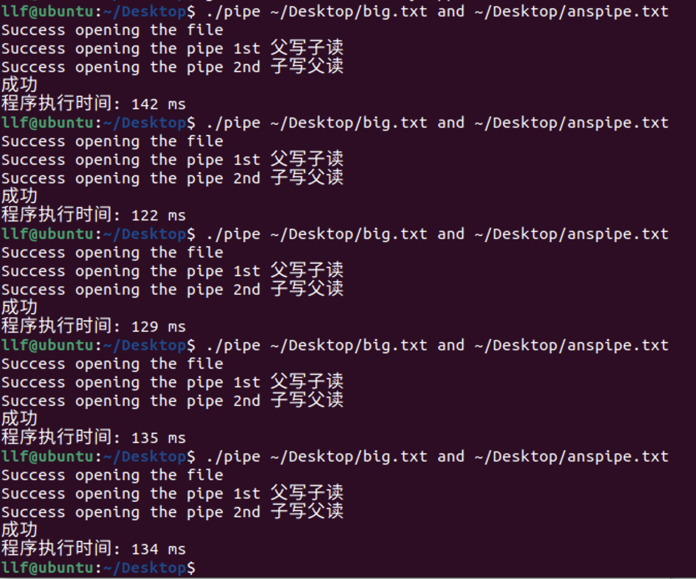
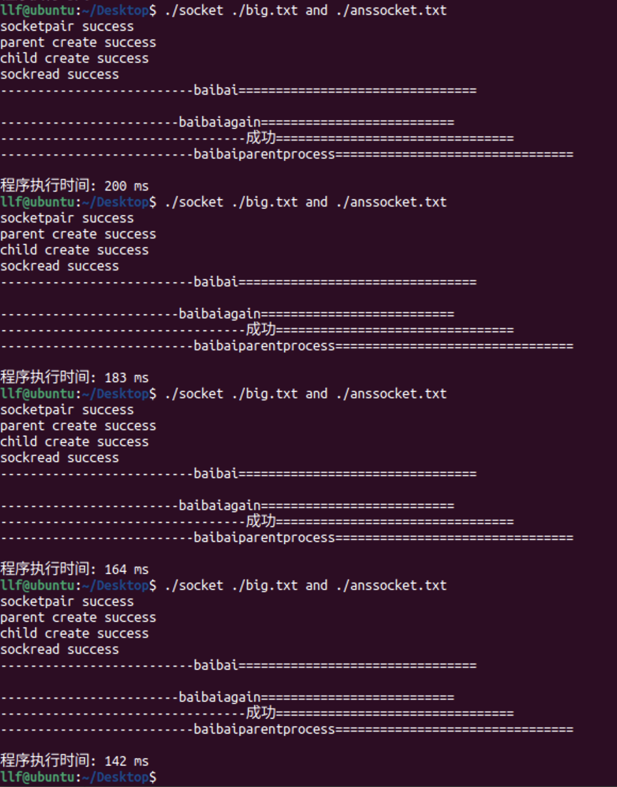
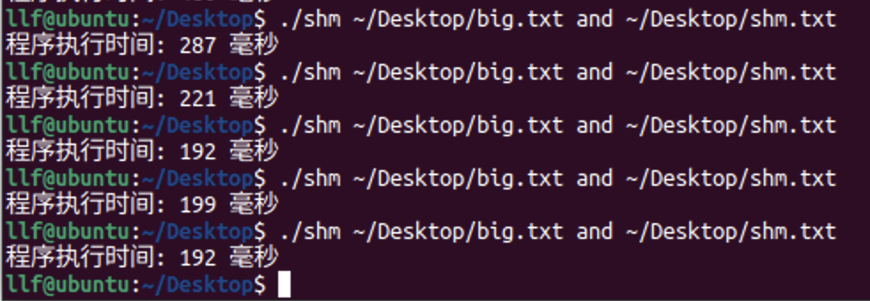
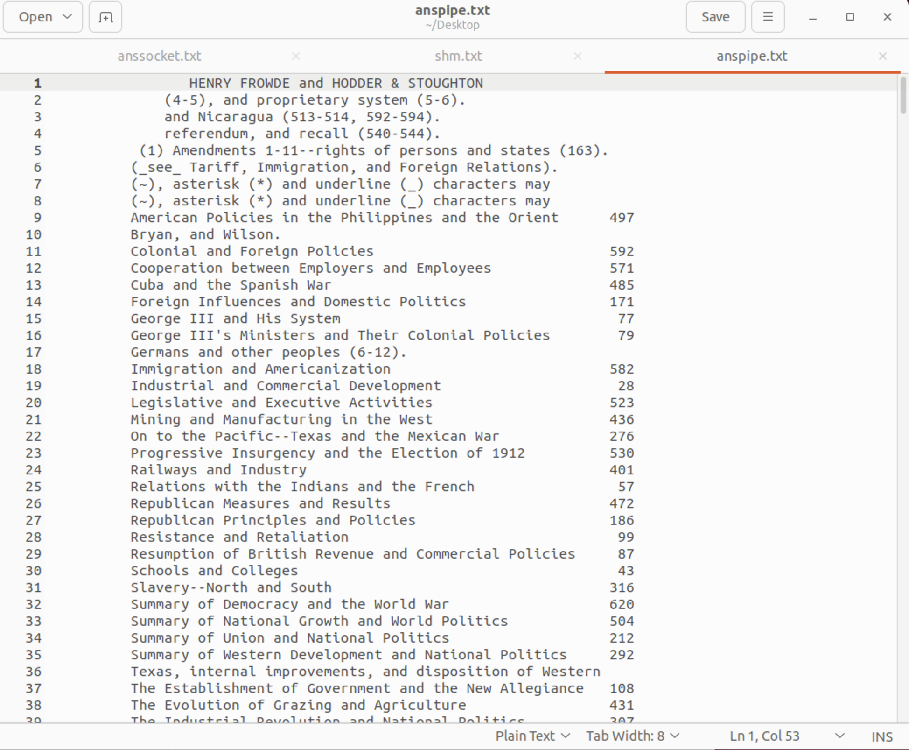
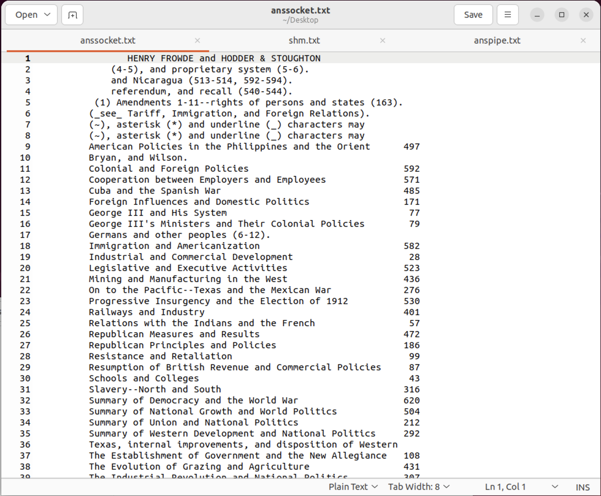
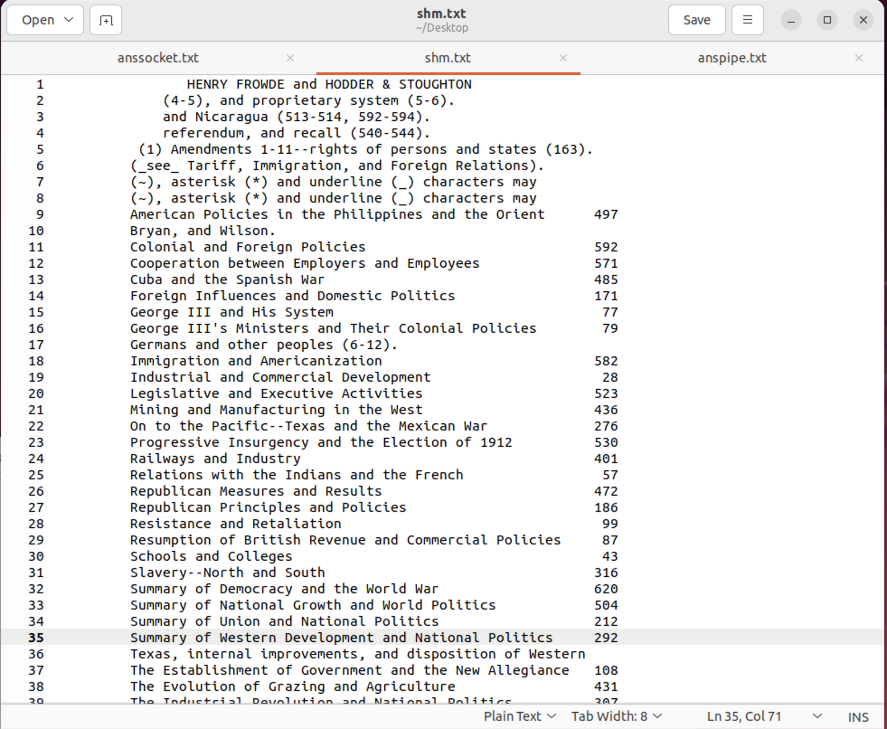

# Project03 IPC and map-reduce

Operating System Homework, Fall 2023

<br />

<div align="center">
  <h3>IPC and map-reduce</h3>
  <p>
    XXXX1209 XXX
  </p>
  <a href="https://github.com/NimbusLongfei/OperatingSystem_HW/tree/main/Lab03"><strong>探索本实验的仓库 »</strong></a>
  <br />
  <br />
  <a href="https://github.com/NimbusLongfei/OperatingSystem_HW/tree/main/Lab03">查看项目</a>
  ·
  <a href="https://github.com">报告Bug</a>
  <!--made by llf-->
</div>

---

实验目的是为了练习各种IPC的方式和map-reduce。

使用到的IPC方式有：管道、Unix域套接字和共享内存，并计算了相同任务下分别使用三种IPC方式的执行时间。

map-reduce是自己设计的多线程程序来实现。


```
 文件结构
Lab03
├── READMELAB03.md
├── Lab03.pdf
├── Makefile
├── src
|    ├── pipe.cpp
|    ├── socketpair.cpp
|    └── sharedmemory.cpp
└── text
     ├── big.txt
     ├── ANNA_KARENINA.txt
     ├── anspipe.txt
     ├── anssocketpair.txt
     └── shm.txt
```

## 目录
- [Project03 IPC and map-reduce](#project03-ipc-and-map-reduce)
  - [目录](#目录)
  - [程序设计与功能](#程序设计与功能)
  - [环境依赖](#环境依赖)
  - [使用方法](#使用方法)
  - [注意事项](#注意事项)
- [Report](#report)
  - [Time the execution of your three programs and analyze what contributes to the performance difference](#time-the-execution-of-your-three-programs-and-analyze-what-contributes-to-the-performance-difference)
  - [My design of the program](#my-design-of-the-program)
  - [Snapshots of experimental results with analysis](#snapshots-of-experimental-results-with-analysis)
  - [Problems encountered and solution](#problems-encountered-and-solution)
  - [Summarize the different IPC methods provided by Linux and describe when to use which](#summarize-the-different-ipc-methods-provided-by-linux-and-describe-when-to-use-which)
  - [A short paragraph about map-reduce](#a-short-paragraph-about-map-reduce)
  - [A short paragraph about Hadoop](#a-short-paragraph-about-hadoop)
  - [Reference materials](#reference-materials)
  - [My suggestions and comments](#my-suggestions-and-comments)
  - [Code](#code)


## 程序设计与功能

1. **功能**
   
    本次实验的任务是：程序读取给定的文本文件，然后输出含有指定单词的行，将行按照字母表顺序排序。

    程序具体完成工作的工序是，创建父子进程，使用父进程读取给定路径的文本文档的内容，然后通过三种不同的IPC方式，将读入的内容传给子进程；子进程收到文本内容后，完成上述任务，将结果通过IPC，写回给父进程，父进程将结果输出。

    还编写了makefile文件，通过指定的规则来完成源代码的编译，将源文件编译为目标文件，并最终链接生成可执行文件。同时还提供了清理编译生成的文件的功能。


2. **设计**

    三个子任务的区别主要在于，父子进程通信以及map-reduce操作，其余的基本输入输出和在句子中查找指定的单词基本一致。

    `输入输出`是才用C++的标准库`fstream`，从文件中读取流和写入流，创建`ofsream流`或者`ifstream流`，使用`getline/fgets`函数从流中读取数据。

    `查找指定单词`使用C++提供的`string`类中的`find`方法，每次从一行中寻找执行的单词是否存在，然后根据`find`函数的返回值，检查寻找到的单词是否是单独的单词而不是某个单词的子串。

    接下来是三个子任务分别使用的IPC方法介绍。

    `sub-project 1` 使用的是pipe通信，pipe是一种半双工通信方式，因为我们需要在父子进程间通信，而且父子都要进行读写，所以使用两个匿名管道来完成通信任务。

    `sub-project 2` 是用的是Unix域套接字来通信，与pipe一个不同是它是全双工通信方式，因此这里的父子进程间通信只需要创建一个匿名的socket即可。

    `sub-project 3` 使用共享内存进行通信，根据key值创建一个shm_id，然后通过shmget和shmat函数创建共享内存段。这段内存被两个进程（通过fork产生的子进程）所共享。
在共享内存中，两个进程可以读写数据。主进程和子进程可以在这段内存中进行数据的存取和修改。
主进程（父进程）将文件内容读入共享内存，子进程则从共享内存中读取数据进行处理。一个需要注意的点是，处理好同步和互斥问题。关于这点，使用了信号量机制来保证程序正确执行，在下文报告中详细叙述。

    `map-reduce`是一种是一种用于处理大规模数据集的编程模型，通常用于并行计算和分布式计算。这个程序使用到了 MapReduce 的概念，尽管是基于线程和共享内存的简化版本，但依然反映了 MapReduce 思想的一些方面。

   **Map 阶段**：
   - 在该程序中，Map 阶段由子线程完成。每个子线程通过 `map` 函数将指定的单词从文本数据中搜索并提取出来，然后将匹配的结果存储在共享的 `result` 结构体中。
   - Map 阶段的目的是在数据中筛选和提取所需内容，这里是搜索特定单词。
  
   **Reduce 阶段**：
   - 在该程序中，Reduce 阶段由 `reduce` 函数完成。`reduce` 函数负责对中间结果进行排序，并将排序后的结果写回到共享内存中。
   - 在经典的 MapReduce 中，Reduce 阶段会对中间结果进行汇总、聚合或其他操作，最终产生最终的输出结果。

   这个程序虽然简化了 MapReduce 的概念，但其中的线程处理、共享内存以及分阶段的数据处理体现了map-reduce 模型的一些特点。


## 环境依赖
运行该程序的环境需要具备以下要求：

1. **操作系统**：支持 POSIX 标准的操作系统，比如 Linux 或类 Unix 系统，因为代码中使用了 POSIX 标准的函数和头文件，例如 `<sys/shm.h>`、`<unistd.h>`、`<pthread.h>` 等。

2. **编译器**：需要支持 C++11 标准及以上的编译器，因为程序中使用了 C++11 的部分特性。常见的编译器如 GCC 或者 Clang 都可以。

3. **内存**：程序使用了共享内存进行进程间通信，因此需要足够的内存来存储数据和运行程序。

4. **权限**：程序中涉及到创建信号量、共享内存等操作，可能需要足够的权限才能执行这些系统调用。

5. **GNU Make 工具**: Makefile 是由 GNU Make 工具解析和执行的，因此需要安装 GNU Make。在大多数类 Unix 系统（例如 Linux、macOS）中，GNU Make 通常是默认安装的，

确保满足了这些基本要求后，你可以在相应的环境中编译和运行该程序。同时，由于程序中使用了多线程、共享内存等操作，确保操作环境和编译工具能够支持这些特性。

## 使用方法

首先，文件的组织结构应该如下：
```
folder
├── big.txt
├── file_out.txt
├── Makefile 
└──src
    └── main.cpp
```

1. 编译程序：
   
   打开终端并切换到包含的目录
   ```bash
   make
   ```
    这将生成名为`main`的可执行文件
2. 运行程序：

   ```bash
   ./main ./big.txt word_to_search ./file_out.txt
   ```

3. 输出

    程序任务的结果将输出在`file_out.txt`中，屏幕会打印出一些程序执行阶段的信息（主要是为了便于调试），以及程序的执行时间。


## 注意事项

- 程序多次执行时间变化较大
- make同时会把OBJ文件放在bulid文件夹下
- 每次只能在`src/`下存放一个子任务的代码，另外该Makefile还规定会把Makefile所在文件夹的代码进行编译，因此不要在当前文件夹存放代码`.cpp`。
- 程序中可能会有一些限制和错误处理不完善之处。


# Report

## Time the execution of your three programs, and analyze what contributes to the performance difference


pipe的平均执行时间为：132ms。



socket的平均执行时间为：172ms。

 

shared memory的平均执行时间为：218ms。

在理论上，共享内存通常是最快的进程间通信方式之一，因为它直接在进程之间共享同一块物理内存，避免了数据的复制和内核空间和用户空间的切换。因此，共享内存通常具有最小的延迟，并且在数据量较大时具有良好的性能。

管道和 socket 是基于消息传递的通信方式，它们会引入内核空间和用户空间之间的数据复制。在管道中，数据被放置在一个缓冲区中传递，而在 socket 通信中，数据通过套接字在网络协议栈中传输。相对于共享内存，管道和 socket 会产生更多的系统调用和数据复制，因此在大量数据传输时可能会引入更多的开销和延迟。

但是性能上的差异会受到多种因素的影响，包括数据量的大小、操作系统的优化、系统负载。

这里的结果和理论有所不同，我认为是因为共享内存的代码中做了一些多余的复制，即将共享内存中筛选出来的行复制到了全局变量result中，在访问内存上耗费了大量的时间。


## My design of the program

**sub-project 1**

它从一个文件中读取文本，检查每行是否包含给定的搜索词，然后将包含搜索词的行按字母顺序排序并写回到另一个文件中。

1. **输入验证**：首先检查程序的命令行参数，确保提供了必要的输入信息。

2. **文件读取**：父进程打开指定文件，并将文件内容写入到一个管道中，以便子进程可以读取处理。

3. **创建管道**：程序创建了两个管道，分别用于父子进程之间的通信。

4. **子进程**：子进程负责从管道中读取父进程发送的文本内容。它将每行文本与指定的搜索词进行比较，符合条件的行被收集到一个向量中，并按字母顺序排序。排序后的结果通过另一个管道发送回父进程。

5. **父进程**：父进程等待子进程执行完成。它从子进程发送的管道中读取已排序的文本行，并将它们写入到另一个输出文件中。

6. **时间测量**：程序使用`chrono`库测量程序的执行时间，并输出执行时间信息。

7. **资源释放**：程序在结束时关闭文件、管道和释放所分配的资源。

这个程序利用了进程间的管道通信机制，以及创建子进程来并行处理文件内容。

**sub-project 2**

使用`socketpair`和`信号量`进行进程间通信，其设计思路可以分为以下几个步骤：

1. **输入验证和参数获取**：检查程序的命令行参数，确保提供了必要的输入信息。包括文件路径、搜索词和输出文件路径。

2. **创建Socket对**：使用`socketpair`创建了一个双向通信的Socket对。这个Socket对会在父子进程之间传递数据。

3. **创建信号量**：使用`sem_open`创建了一个信号量，用于在父子进程之间进行同步操作。

4. **子进程**：子进程读取来自Socket的数据，检查每行文本是否包含给定的搜索词，符合条件的行被收集到一个向量中，并按字母顺序排序后发送回父进程。

5. **父进程**：父进程打开指定文件，将文件内容写入到Socket中，然后等待子进程处理。在子进程处理完毕后，从Socket中读取已排序的文本行，并将它们写入到指定的输出文件中。

6. **时间测量**：程序使用`chrono`库测量程序的执行时间，并输出执行时间信息。

7. **资源释放**：程序在结束时关闭Socket和信号量，并释放所分配的资源。

这个程序的核心是使用Socket在父子进程之间传递数据，利用子进程处理文本和排序的任务，并通过信号量来实现进程之间的同步。

在这个程序中，信号量的作用是实现父子进程之间的同步操作。具体来说，这个程序使用了一个信号量来确保子进程在处理数据后，父进程才能继续执行。

在程序中的具体流程是这样的：

1. 父进程创建了一个信号量并命名为`/test`。
2. 子进程在处理完数据后，使用`sem_post`函数增加信号量的计数器，表示子进程已经完成了处理任务。
3. 父进程在调用`sem_wait`函数时会被阻塞，直到信号量的计数器大于0，即子进程已经完成任务并调用了`sem_post`来释放信号量，父进程才会继续执行下去。

这个信号量起到了一个同步的作用，保证了父进程和子进程之间的顺序执行，使得父进程在接收到子进程处理完数据的信号后再继续后续的操作，例如从Socket中读取排序好的数据并写入文件。

**sub-project 3**

这段程序展示了一个多线程的文本搜索和排序的操作，使用了共享内存、线程间通信以及互斥锁来实现。

1. **参数解析和初始化：**  
   程序开始时，解析命令行参数，获取文件路径、要搜索的词以及输出文件路径。然后创建了两个命名信号量 `/a` 和 `/b`，以便父子进程之间进行同步。

2. **共享内存的创建和读取：**  
   通过 `shmget` 获取共享内存的标识符，并通过 `shmat` 将共享内存连接到进程的地址空间中，以便父子进程共享数据。父进程将待处理的数据写入共享内存，并增加信号量 `/a`，通知子进程开始处理。

3. **多线程数据处理：**  
   子进程接收到信号量 `/a` 后，启动多个线程并传递相应参数，对共享内存中的数据进行搜索操作。在搜索过程中，对于找到的匹配串，通过互斥锁将结果存储到全局的 `result` 结构中。

4. **排序和写入文件：**  
   等待所有线程处理完毕后，子进程调用 `reduce` 函数，使用互斥锁对搜索结果进行排序，并将排序好的结果复制回共享内存。然后增加信号量 `/b`，通知父进程可以读取数据。父进程等待信号量 `/b`，从共享内存中读取数据并写入到输出文件。

5. **清理和计时：**  
   最后，关闭共享内存和信号量，并记录程序的执行时间。

这个程序利用了共享内存在父子进程之间传递数据，在子进程内使用多线程对数据进行并行处理，在处理完毕后对结果进行排序并传递给父进程进行最终的输出。


**Makefile**

`makefile` 文件主要用于编译一个 C++ 项目，并且包含了一些规则和命令，用来完成代码的构建、编译和清理。通过指定的规则来完成源代码的编译，将源文件编译为目标文件，并最终链接生成可执行文件。同时还提供了清理编译生成的文件的功能。

  
## Snapshots of experimental results with analysis


 

 





 

程序的执行结果一致。


## Problems encountered and solution

在编写代码过程中我遇到了以下一些问题：

1. **大文件读取**

    我发现在MacOS中，全局变量的大小受到限制比较多，同样的代码移植到Ubuntu上，不会发生`SIGSEG`，猜测是系统有所限制。

2. **文件输出显示问题**

    最初选择把结果输出到屏幕上，发现显示存在问题，所以考虑将结果输出到文件中，发现结果就正确了，所以在输出大量内容时需要考虑屏幕能否正常显示。
    
    另外还需要注意输出缓冲区的问题，常见的系统是行缓冲，遇到换行符或者缓冲区满了才会输出，为了能够按照程序员的意愿正常输出，需要在每次输出后清空缓冲区，避免在输入输出上花费太多时间。

3. **父子进程间同步问题**

    在使用socket时，因为父进程写入子进程读回，与子进程写入父进程读回共用一个socket，而父子进程之间是并发执行，所以需要同步进程，保证在子进程第一次读完之后才会使父进程执行写入代码。

    同样的问题也在共享内存中遇到，因此需要信号量来同步两个进程的执行。

4. **临界资源访问**

    共享内存子任务中，使用了map reduce的编程方法，因此在使用多线程来执行时，需要把结果写入全局变量中，那么四个子线程写同一个量，就需要注意互斥访问的问题。因此在程序中添加了互斥锁来保证写入不会出错。


5. **自定通信协议**

    在使用socket时出现了父进程已经写完了内容，但是子进程还是在等待读入的问题，是因为父子进程之间通信的协议没有规定，子进程不知道父进程已经写完了，所以程序陷入等待无法结束。

    为了解决这个问题，我规定了通信的结束标志，一旦父进程把文件全部写入后，需要传入一个特殊的字符串来告诉子进程已经写入完成，在子进程中检测是否出现该特殊字符，顺利解决该问题。

## Summarize the different IPC methods provided by Linux and describe when to use which
Linux提供了多种进程间通信（IPC）的方式，每种方式都有其特点和适用场景。

以下是一些常用的进程间通信方式以及其特点：

1. **管道（Pipe）**：
   - **特点**：单向通信，适用于具有亲缘关系的进程（父子进程）。
   - **类型**：匿名管道（使用`pipe()`系统调用）和命名管道（FIFO）。
   - **限制**：只能在具有共同祖先的进程之间通信。

2. **消息队列（Message Queues）**：
   - **特点**：允许多个进程通过读写消息队列进行通信。
   - **类型**：POSIX消息队列和System V消息队列。
   - **优势**：可以发送消息的长度和类型不受限制，具有独立的消息队列标识符。

3. **共享内存（Shared Memory）**：
   - **特点**：允许多个进程访问同一块内存空间，数据共享更快速。
   - **使用**：通过`shmget()`获取共享内存区域，`shmat()`将其附加到进程的地址空间，`shmdt()`和`shmctl()`来分离和控制共享内存。
   - **注意**：需要显式地处理同步和互斥。

4. **信号量（Semaphores）**：
   - **特点**：用于多个进程对共享资源的访问控制。
   - **使用**：通过`sem_open()`打开信号量，`sem_wait()`、`sem_post()`等操作控制访问。
   - **用途**：可以用于实现互斥锁、条件变量等同步机制。

5. **套接字（Sockets）**：
   - **特点**：可在不同主机或同一主机上的进程之间进行通信。
   - **类型**：Unix域套接字（用于本地进程通信）和网络套接字（用于网络通信）。
   - **优势**：具有灵活性和强大的功能，支持多种协议和通信方式。

在选择进程间通信的方式时，需要考虑以下因素：
- **通信的需求**：通信对象是本地进程还是远程进程，通信频率、数据大小等。
- **性能**：不同通信方式有不同的性能开销，选择合适的方式能够更高效地进行通信。
- **复杂度**：不同方式的实现难度不同，需要根据具体情况考虑简洁性和灵活性。
- **安全性**：有些方式可能涉及更多的安全风险，需要考虑数据的保密性和完整性。

根据实际需求和具体情况，可以综合考虑以上因素，选择适合的IPC方式。


## A short paragraph about map-reduce
1、MapReduce 定义

MapReduce 是一个分布式运算程序的编程框架，是用户开发“基于 Hadoop 的数据分析应用”的核心框架。

MapReduce 核心功能是将用户编写的业务逻辑代码和自带默认组件整合成一个完整的分布式运算程序，并发运行在一个 Hadoop 集群上。

它将计算任务分为两个阶段：Map和Reduce。在Map阶段，数据被分割为若干独立的部分，并由多个并行运行的节点进行处理。每个节点都将输入数据转换为一系列键-值对。在Reduce阶段，这些键-值对根据键进行合并和汇总，最终得到最终的输出结果。

2、MapReduce 优缺点

**优点**

MapReduce模型的优势在于其横向扩展性和容错性，能够高效处理大规模数据并充分利用分布式计算资源。

1 ）MapReduce 易于编程

它简单的实现一些接口，就可以完成一个分布式程序，这个分布式程序可以分布到大量廉价的 PC 机器上运行。

2 ）良好的扩展性

当你的计算资源不能得到满足的时候，你可以通过简单的增加机器来扩展它的计算能力。

3 ） 高容错性

MapReduce 设计的初衷就是使程序能够部署在廉价的 PC 机器上，这就要求它具有很高的容错性。比如其中一台机器挂了，它可以把上面的计算任务转移到另外一个节点上运行，不至于这个任务运行失败，而且这个过程不需要人工参与，而完全是由Hadoop内部完成的。

4 ） 适合 PB 级以上海量数据的离线处理

可以实现上千台服务器集群并发工作，提供数据处理能力。

缺点

1 ） 不擅长实时计算

MapReduce 无法像 MySQL 一样，在毫秒或者秒级内返回结果。

2 ） 不擅长流式计算

流式计算的输入数据是动态的，而 MapReduce 的输入数据集是静态的，不能动态变化。这是因为 MapReduce 自身的设计特点决定了数据源必须是静态的。

3 ） 不擅长有向无环图的计算

多个应用程序存在依赖关系，后一个应用程序的输入为前一个的输出。在这种情况下，MapReduce 并不是不能做，而是使用后，每个 MapReduce 作业的输出结果都会写入到磁盘，会造成大量的磁盘 IO，导致性能非常的低下。

## A short paragraph about Hadoop

Hadoop是一个开源的分布式计算框架，用于处理大规模数据集。它提供了可靠、高效的数据存储和处理方式，包括Hadoop分布式文件系统（HDFS）和MapReduce计算模型。Hadoop的核心设计理念是能够在成百上千台服务器上并行处理数据，通过分布式存储和计算来处理海量数据。这使得Hadoop成为大数据处理的理想解决方案，广泛应用于各种场景，包括数据分析、机器学习、日志处理等领域。

Hadoop由两个主要组件组成。

### Hadoop的主要组件
1. Hadoop分布式文件系统（HDFS）：作为Hadoop应用程序的主要数据存储系统，HDFS管理集群中数据的访问。它通过NameNode和DataNode的架构来实现，其中每个集群包括一个NameNode和多个DataNode。
2. Hadoop YARN：YARN是Hadoop的集群资源管理和作业调度技术。它位于HDFS和用户部署的处理引擎之间，通过容器、应用协调器和节点级监控代理的组合，动态分配集群资源给应用程序，并监督处理作业的执行。

### Hadoop的优势
Hadoop具有以下优势，使其成为处理大数据的理想选择：
1. 能够存储和处理结构化、半结构化和非结构化数据。
2. 可以保护应用程序和数据处理免受硬件故障的影响。如果集群中的某个节点发生故障，Hadoop会自动将处理作业重定向到其他节点，以确保应用程序继续运行。
3. 不需要在存储之前处理数据。组织可以将原始数据存储在HDFS中，并在以后决定如何处理和过滤数据以支持特定的分析需求。
4. 可扩展性强，公司可以根据需要向集群添加更多节点，以处理更多数据或增加的处理工作负载。
5. 可以支持实时分析应用程序，帮助推动更好的运营决策，同时也支持历史分析的批处理工作负载。

总的来说，Hadoop使组织能够收集、存储和分析更多的数据，从而扩展分析应用程序，并为企业高管、经理和员工提供以前无法获取的信息。

Learn more:


## Reference materials

1. **C语言编程文档**：- 网址：[cplusplus.com](http://www.cplusplus.com/reference/clibrary/)

2. **Linux_bash_cheat_sheet-1**：

3. **Abraham-Silberschatz-Operating-System-Concepts-10th-2018**

4. [What is Hadoop? | Definition from TechTarget](https://www.techtarget.com/searchdatamanagement/definition/Hadoop)

5. [Introduction to Hadoop - GeeksforGeeks](https://www.geeksforgeeks.org/hadoop-an-introduction/)

6. [Apache Hadoop](https://hadoop.apache.org/)

<!--made by llf-->

## My suggestions and comments

实验非常的有实际价值，很锻炼编程能力！


## Code

`Makefile`
```Makefile
CXX = g++
SRC = $(wildcard *.cpp ./src/*.cpp)
OBJ := $(patsubst ./src/%.cpp,./build/%.o,$(SRC))
OBJ := $(patsubst %.cpp,./build/%.o,$(OBJ))
CXXFLAG := -I include -g
TARGET = main
dir_name := ./build

$(shell if [ ! -e $(dir_name) ];then mkdir $(dir_name); fi)
$(TARGET): $(OBJ)
#	echo $(OBJ)
	$(CXX) -o $@ $^ 
./build/%.o: %.cpp
	$(CXX) -o $@ -c $< $(CXXFLAG)

./build/%.o: ./src/%.cpp
	$(CXX) -o $@ -c $< $(CXXFLAG)
.PHONY:clean

clean:
	rm -rf $(TARGET)
	rm -rf $(OBJ)

```


`sub-project 1`
```cpp
#include <iostream>
#include <fstream>
#include <string>
#include <unistd.h>
#include <sys/types.h>
#include <sys/wait.h>
#include <locale>  // 用于 UTF-8 编码支持
#include <istream>
#include <chrono>
#include <cstring>
#include <vector>
#include <algorithm>
using namespace std;


int main(int argc, char *argv[]) {
    auto start = std::chrono::high_resolution_clock::now();
    if (argc != 4) {
        cerr << "Usage: " << argv[0] << " <file_path> <find_word>" << endl;
        exit(1);
    }else{
        cout << "Success opening the file" << endl;
    }
    string file_path = argv[1];
    const char *word_to_search = argv[2];
    string file_out_path = argv[3];

    // 父写子读
    int pipe_fd[2];
    if (pipe(pipe_fd) == -1) {
        perror("pipe");
        exit(1);
    } else {
        cout << "Success opening the pipe 1st 父写子读" << endl;
    }
    // 子写父读
    int pipe_fd2[2];
    if (pipe(pipe_fd2) == -1) {
        perror("pipe");
        return 1;
    }else{
        cout << "Success opening the pipe 2nd 子写父读" << endl;
    }

    // 子进程创建
    pid_t child_pid = fork();
    if (child_pid == -1) {
        perror("fork");
        return 1;


    }else if (child_pid == 0) { // Child
        close(pipe_fd[1]); // Close write end
        close(pipe_fd2[0]); // Close read end

        FILE* pipe_read = fdopen(pipe_fd[0], "r");

        if (pipe_read != nullptr) {

            vector<string> stline;
            char line[1024];

            while (fgets(line, sizeof(line), pipe_read)) {
                size_t len = strlen(line);

                // 去除末尾的换行符
                if (len > 0 && line[len - 1] == '\n') {
                    line[len - 1] = '\0';
                    len--;
                }

                string ll(line);
                size_t pos = ll.find(word_to_search);
                if (pos != string::npos) {
                    stline.push_back(ll);
                    if(isalpha(ll[pos - 1]) || isalpha(ll[pos + strlen(argv[2])])){
                       stline.pop_back();
                    }
                }
            }

            // 按字母表排序
            sort(stline.begin(), stline.end());

            // 将排序后的字符串写回到管道
            for (auto& now : stline) {
                now +="\n";
                write(pipe_fd2[1], now.c_str(), now.size());
            }

            cout << "成功" << endl;

            close(pipe_fd[0]);
            close(pipe_fd2[1]);
            exit(0);
        }


    } else if(child_pid > 0){ // Parent
        close(pipe_fd[0]); // Close read end
        close(pipe_fd2[1]); // write end

        ifstream file(file_path);

        if (file.is_open()) {
            string line;
            while (getline(file, line)) {
                line +="\n";
                write(pipe_fd[1], line.c_str(), line.size());
            }
        }
        file.close();
        close(pipe_fd[1]);

        FILE  * pipe_readagain = fdopen(pipe_fd2[0], "r");
        if(pipe_readagain != nullptr){
            char ans[1024];
            ofstream fileout(file_out_path, ios::out | ios::binary);
            while (fgets(ans, sizeof(ans), pipe_readagain)) {
                size_t len = strlen(ans);

                // 去除末尾的换行符
                if (len > 0 && ans[len - 1] == '\n') {
                    ans[len - 1] = '\0';
                    len--;
                }
                fileout << ans << endl;
            }

            fileout.close();
        }
        close(pipe_fd2[0]);

        int status;
        wait(&status);

        // 记录结束时间点
        auto end = std::chrono::high_resolution_clock::now();

        // 计算执行时间并转换为毫秒
        auto duration = std::chrono::duration_cast<std::chrono::milliseconds>(end - start);

        // 输出执行时间
        std::cout << "程序执行时间: " << duration.count() << " ms" << std::endl;

        exit(0);
    }

    return 0;
}

```

`sub-project 2`
```cpp
#include <iostream>
#include <fstream>
#include <cstring>
#include <unistd.h>
#include <sys/socket.h>
#include <semaphore.h>
#include <chrono>
#include <cstring>
#include <algorithm>
#include <fcntl.h>
using namespace std;

int main(int argc, char *argv[]) {
    auto start = std::chrono::high_resolution_clock::now();
    if (argc != 4) {
        cerr << "Usage: " << argv[0] << " <file_path> <word_to_search>" << std::endl;
        return 1;
    }

    string file_path = argv[1];
    string word_to_search = argv[2];
    string file_out_path = argv[3];

    int sockfd[2];
    if (socketpair(AF_UNIX, SOCK_STREAM, 0, sockfd) == -1) {
        perror("socketpair");
        return 1;
    }else   cout << "socketpair success\n";

    sem_t* p = sem_open("/test",O_CREAT|O_RDWR,0666,0);

    pid_t child_pid = fork();

    if (child_pid == -1) {
        perror("fork");
        return 1;
    }else if (child_pid == 0) { // Child process
        cout << "child create success\n";

//        fcntl(sockfd[1], F_SETFL, O_NONBLOCK);
//        ofstream  fileout(file_out_path, ios::out | ios::binary);
        FILE * sockread = fdopen(sockfd[1], "r+b");// 读写
        if (sockread != nullptr) {
            cout << "sockread success\n";
            vector<string> stline;
            char line[1024];
            int i =0;
            while (fgets(line, sizeof(line), sockread)) {
                size_t len = strlen(line);

                // 去除末尾的换行符
                if (len > 0 && line[len - 1] == '\n') {
                    line[len - 1] = '\0';
                    len--;
                }
                if(*((int*)line)==0XDEADBEEF){
                    cout << "--------------------------baibai================================\n" << endl;
                    break;
                }
//                cout << i++ << endl;
//                if(i >= 1) cout << (int)line[0] << "--" << line << "--"<<  endl;
//                fileout <<i++<< line << endl;
                string ll(line);

                size_t pos = ll.find(argv[2]);
                if (pos != string::npos) {
                    bool should_add = true;
                    if (isalpha(ll[pos - 1]) || isalpha(ll[pos + strlen(argv[2])])) {
                        should_add = false;
                    }
                    if (should_add) {
                        stline.push_back(ll);
                    }
                }
            }

            cout << "------------------------baibaiagain=========================="<<endl;

            sem_post(p);

            // 按字母表排序
            sort(stline.begin(), stline.end());

            for (auto& now : stline) {
                now +="\n";
                write(sockfd[1], now.c_str(), now.size());
            }

            int x = 0xDEADBEEF;
            write(sockfd[1], &x, 4);
            char  huanhang = '\n';
            write(sockfd[1], &huanhang, 1);

            cout << "---------------------------------成功================================" << endl;
            close(sockfd[1]);
            close(sockfd[0]);
//            fileout.close();
            sem_close(p);
            exit(0);
        }
        exit(1);
    } else if(child_pid > 0){ // Parent process
        cout << "parent create success\n";

        int buffer_size = 800000;  // 设置缓冲区大小，可以根据需要调整
        if (setsockopt(sockfd[0], SOL_SOCKET, SO_RCVBUF, &buffer_size, sizeof(buffer_size)) == -1) {
            perror("setsockopt");
            return 1;
        }

//        fcntl(sockfd[0], F_SETFL, O_NONBLOCK);
        ofstream fileout(file_out_path, ios::out | ios::binary);
        ifstream file(file_path);
        if (file.is_open()) {
            string line;
            while (getline(file, line)) {
                line +="\n";
                write(sockfd[0], line.c_str(), line.size());
            }
            int x = 0xDEADBEEF;
            write(sockfd[0], &x, 4);
            char  huanhang = '\n';
            write(sockfd[0], &huanhang, 1);
            file.close();
        }

//        sleep(5);
        sem_wait(p);

        FILE  * sock_readagain = fdopen(sockfd[0], "rb");
        if(sock_readagain != nullptr){
            char ans[1024];
            while (fgets(ans, sizeof(ans), sock_readagain)) {
                size_t len = strlen(ans);

                // 去除末尾的换行符
                if (len > 0 && ans[len - 1] == '\n') {
                    ans[len - 1] = '\0';
                    len--;
                }
                if(*((int*)ans)==0XDEADBEEF){
                    cout << "--------------------------baibaiparentprocess================================\n" << endl;
                    break;
                }
                fileout << ans << endl;
            }
            shutdown(sockfd[0], SHUT_WR);

            fileout.close();
        }
        close(sockfd[0]);
        close(sockfd[1]);
        sem_close(p);

        // 记录结束时间点
        auto end = std::chrono::high_resolution_clock::now();

        // 计算执行时间并转换为毫秒
        auto duration = std::chrono::duration_cast<std::chrono::milliseconds>(end - start);

        // 输出执行时间
        std::cout << "程序执行时间: " << duration.count() << " ms" << std::endl;

        exit(0);
    }

    return 0;
}

```

`sub-project 3`
```cpp
#include <iostream>
#include <sys/shm.h>
#include <unistd.h>
#include <string>
#include <pthread.h>
#include <fstream>
#include <semaphore.h>
#include <algorithm>
#include<cstring>
#include<fcntl.h>
#include <chrono>

#define LINE_SIZE 130000
#define SIZE 1200
#define NUM_THREADS 4

typedef struct {
    char data[LINE_SIZE][SIZE];
    int l;
} SharedData;

typedef struct{
    char * now;
    char * search_word;
    int len;
} param;

typedef struct {
    char ans[LINE_SIZE][SIZE];
    int index;
} r;

r result;
pthread_mutex_t mutex;

void reduce(SharedData *shared_data);
void * map(void *arg);

int main(int argc, char *argv[]) {
    auto start = std::chrono::high_resolution_clock::now();

    if (argc != 4) {
        std::cerr << "Usage: " << argv[0] << " <file_path> <word_to_search> <file_out>" << std::endl;
        return 1;
    }


    char *file_path = argv[1];
    char *word_to_search = argv[2];
    char *file_out = argv[3];

    sem_t* a = sem_open("/a",O_CREAT|O_RDWR,0666,0);
    sem_t* b = sem_open("/b",O_CREAT|O_RDWR,0666,0);

    // 创建共享内存
    key_t key = ftok("./shmfile", 66);
    int shm_id = shmget(key, sizeof(SharedData), 0666 | IPC_CREAT);
    SharedData *shared_data = (SharedData *)shmat(shm_id, (void *)0, 0);

    pthread_mutex_init(&mutex, NULL);

    pid_t child_pid = fork();
    if(child_pid == -1){
        perror("fork");
        return 1;
    } else if(child_pid == 0 ){
        pthread_t threads[NUM_THREADS];
//        std::ofstream fileout(file_out, std::ios::out | std::ios::binary);

        sem_wait(a);
//            for(int k = 0; k < shared_data->l; k++){
//                fileout<<shared_data->data[k];
//                fileout.flush();
//            }

        param  nowparam[NUM_THREADS];
        for (int i = 0; i < NUM_THREADS; i++) {
            int len = shared_data->l / NUM_THREADS;

            if(i != NUM_THREADS - 1){
                nowparam[i].len = len;
            }else nowparam[i].len = shared_data->l - (NUM_THREADS - 1)*len;

            nowparam[i].now = shared_data->data[i * len];

            nowparam[i].search_word = word_to_search;

            if (pthread_create(&threads[i], NULL, map, &nowparam[i]) != 0) {
                perror("pthread_create");
                return 1;
            }
        }
        for (int i = 0; i < NUM_THREADS; ++i) {
            if (pthread_join(threads[i], NULL) != 0) {
                perror("pthread_join");
                return 1;
            }
        }


        memset(shared_data->data, 0, sizeof(shared_data->data));

//        shared_data->l = result.index;
//        for (int i = 0; i < result.index && i < LINE_SIZE; ++i) {
//            strncpy(shared_data->data[i], result.ans[i], SIZE - 1);
//        }

        reduce(shared_data);
        sem_post(b);
//        fileout.close();
        shmdt(shared_data);
        exit(0);
    } else if(child_pid > 0){
        std::ofstream fileout(file_out, std::ios::out | std::ios::binary);
        FILE *file = fopen(file_path, "r");

        int cnt = 0;
        char line[SIZE];
        while(std::fgets(line, sizeof(line), file)){
            strncpy(shared_data->data[cnt++], line, SIZE - 1);
        }
        shared_data->l = cnt;
        sem_post(a);

        sem_wait(b);
        for (int i = 0; i < shared_data->l; ++i) {
            fileout << shared_data->data[i];
            fileout.flush();
        }

        shmdt(shared_data);
        shmctl(shm_id, IPC_RMID, NULL); // 标记共享内存可以被删除
        sem_close(a); // 关闭信号量
        sem_unlink("/a"); // 移除信号量
        sem_close(b); // 关闭信号量
        sem_unlink("/b"); // 移除信号量
        pthread_mutex_destroy(&mutex);
        fileout.close();
        
        // 记录结束时间点
    auto end = std::chrono::high_resolution_clock::now();

    // 计算执行时间并转换为毫秒
    auto duration = std::chrono::duration_cast<std::chrono::milliseconds>(end - start);

    // 输出执行时间
    std::cout << "程序执行时间: " << duration.count() << " 毫秒" << std::endl;
    
    
        exit(0);
    }

    return 0;
}


void *map(void *arg) {
    param *param_data = (param *)arg;

    char *current_line = param_data->now;
    char *search_word = param_data->search_word;
    int length = param_data->len;

    for(int k = 0; k < length; k++){
        bool flag = false;
        std::string ll(current_line);
        size_t pos = ll.find(search_word);
        if (pos != std::string::npos) {
            flag = true;
            if(isalpha(ll[pos - 1]) || isalpha(ll[pos + strlen(search_word)])){
                flag = false;
            }
        }
        if(flag){
            pthread_mutex_lock(&mutex);
            strncpy(result.ans[result.index], ll.c_str(), SIZE - 1);
            ++result.index;
            pthread_mutex_unlock(&mutex);
        }
        current_line += SIZE;
    }

    return NULL;
}
void swap(char* a, char* b, int size) {
    char temp[SIZE];
    strncpy(temp, a, size - 1);
    strncpy(a, b, size - 1);
    strncpy(b, temp, size - 1);
}

int partition(char arr[LINE_SIZE][SIZE], int low, int high) {
    char* pivot = arr[high];
    int i = low - 1;

    for (int j = low; j <= high - 1; ++j) {
        if (strcmp(arr[j], pivot) < 0) {
            ++i;
            swap(arr[i], arr[j], SIZE);
        }
    }
    swap(arr[i + 1], arr[high], SIZE);
    return i + 1;
}

void quickSort(char arr[LINE_SIZE][SIZE], int low, int high) {
    if (low < high) {
        int pi = partition(arr, low, high);
        quickSort(arr, low, pi - 1);
        quickSort(arr, pi + 1, high);
    }
}


void reduce(SharedData* shared_data) {
    pthread_mutex_lock(&mutex); // Lock mutex

//    for (int i = 0; i < result.index; ++i) {
//        for (int j = 0; j < result.index - i; ++j) {
//            if (strcmp(result.ans[j], result.ans[j + 1]) > 0) {
//                char temp[SIZE];
//                strncpy(temp, result.ans[j], SIZE - 1);
//                strncpy(result.ans[j], result.ans[j + 1], SIZE - 1);
//                strncpy(result.ans[j + 1], temp, SIZE - 1);
//            }
//        }
//    }

    quickSort(result.ans, 0, result.index - 1);

    // Copy sorted strings back to shared_data
    for (int i = 0; i < result.index && i < LINE_SIZE; ++i) {
        strncpy(shared_data->data[i], result.ans[i], SIZE - 1);
    }

    shared_data->l = result.index;

    pthread_mutex_unlock(&mutex);
}


```