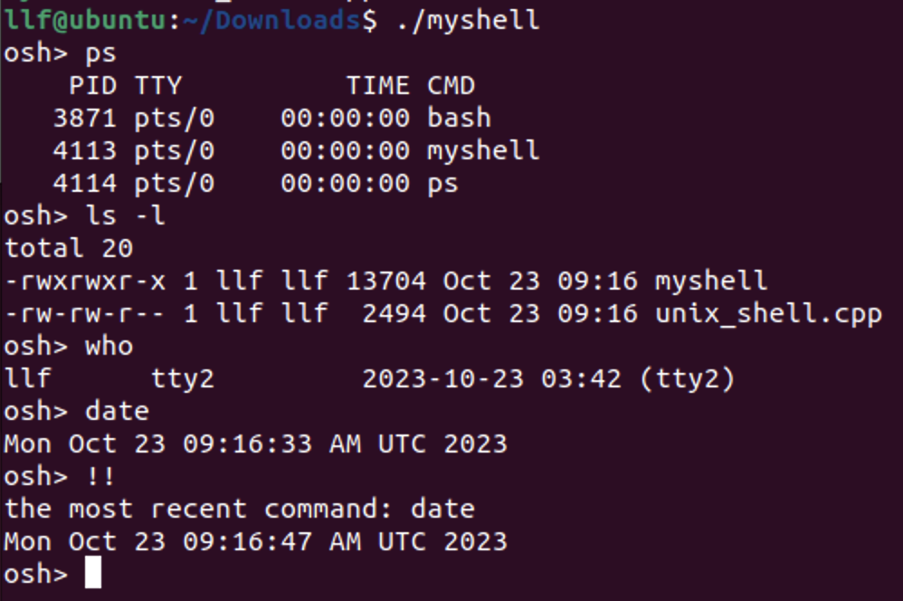
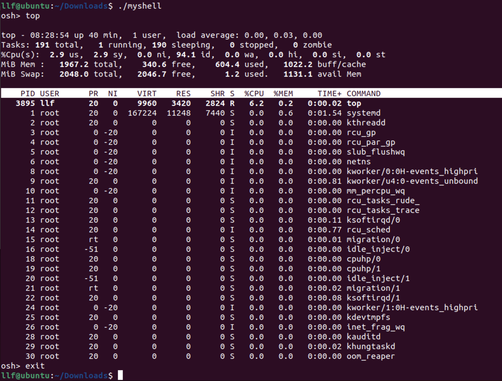
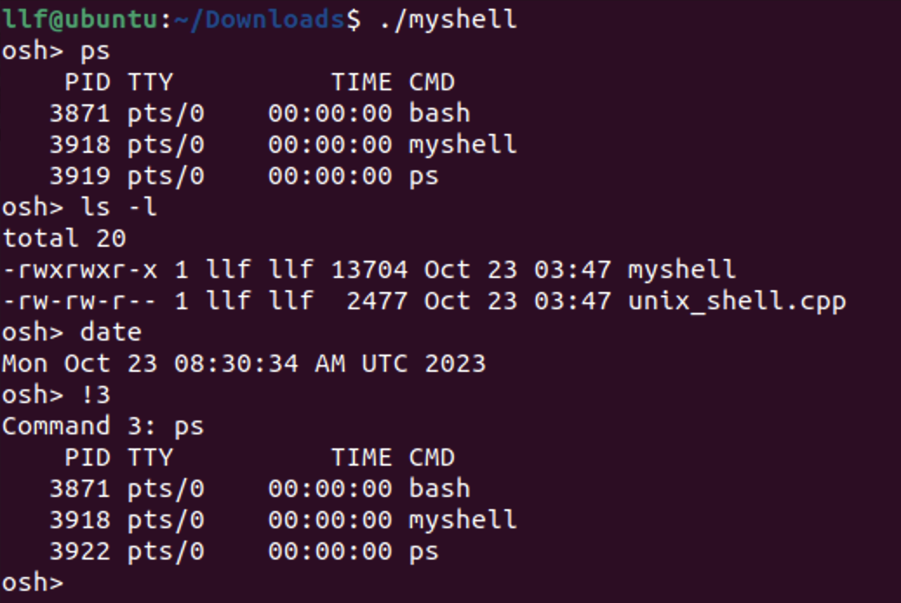

# Project01 UNIX Shell with History Feature

Operating System Homework, Fall 2023

<br />

<div align="center">
  <h3>Unix Shell with History Feature</h3>
  <p>
    XXXX1209 XXX
  </p>
  <a href="https://github.com/NimbusLongfei/OS-HW"><strong>探索本实验的仓库 »</strong></a>
  <br />
  <br />
  <a href="https://github.com/NimbusLongfei/OS-HW">查看项目</a>
  ·
  <a href="https://github.com/NimbusLongfei/OS-HW/issues">报告Bug</a>
  ·
  <a href="https://github.com/NimbusLongfei/OS-HW/issues">提出新特性</a>
</div>

---

这是一个简单的通过创建子进程来执行shell命令行程序，允许用户输入命令，并执行这些命令。该程序提供了一些基本的功能，如历史命令记录、后台并发运行命令等。

```
 文件结构
XXXX1209_XXX
├── README.md
├── Lab01.pdf
└── unix_shell.cpp
```
## 目录
- [Project01 UNIX Shell with History Feature](#project01-unix-shell-with-history-feature)
  - [目录](#目录)
  - [功能特点](#功能特点)
  - [环境依赖](#环境依赖)
  - [使用方法](#使用方法)
  - [注意事项](#注意事项)
  - [The process control methods provided by Linux](#the-process-control-methods-provided-by-linux)
    - [具体的一些方法](#具体的一些方法)
  - [My design of the program](#my-design-of-the-program)
  - [Snapshots of experimental results with analysis](#snapshots-of-experimental-results-with-analysis)
  - [Problems encountered and solution](#problems-encountered-and-solution)
  - [Reference materials](#reference-materials)
  - [My suggestions and comments](#my-suggestions-and-comments)
  - [Code](#code)


## 功能特点

1. **执行基本的命令**：如`ls`，`pwd`，`mkdir`等
2. **命令历史记录**：可以使用 `!!` 来重复执行最近的命令，或使用 `!n` 来执行第 n 条历史命令。

3. **并发运行命令**：在命令末尾加上 `&` 可以使命令在后台并发运行。

4. **退出**：输入 "exit" 可以退出程序。

5. **错误处理**：程序会处理一些简单的错误情况，并提供错误消息。

6. **子进程控制**：程序使用 `fork()` 创建子进程来执行命令，并可以等待子进程终止。


## 环境依赖
要编译和运行这个Shell，您需要满足以下环境依赖：
1. C++编译器：需要一个C++编译器来编译C++代码。可以使用`g++`。

2. POSIX标准库：这个Shell使用了POSIX标准库函数，因此要确保操作系统支持这些函数。

## 使用方法

1. 编译程序：
   
   打开终端并切换到包含Shell代码的目录
   ```bash
   g++ unix_shell.cpp -o myshell
   ```
    这将生成一个名为`myshell`的可执行文件
2. 运行程序：

   ```bash
   ./myshell
   ```

3. 输入命令：

   输入命令，然后按 Enter 键执行。可以使用历史命令、添加并发运行符号`&`。

4. 退出程序：

   输入 "exit" 以退出程序。

## 注意事项

- 请注意，这是一个基本的示例程序，不支持高级特性如重定向或管道等。

- 程序中可能会有一些限制和错误处理不完善之处。


## The process control methods provided by Linux

    Linux提供了多种进程控制方法，下面对一些方法进行概括。

1. **信号（Signals）**：
    - 信号是用于与正在运行的进程进行通信的一种方式。它们可以用于中断、终止、暂停或重新启动进程，以及执行其他操作。
    
2. **进程优先级和调度**：
    - 操作系统分配和管理进程的CPU时间以及优先级。这可以通过调度策略来控制。
    
3. **进程状态管理**：
   - 使用多种进程状态（就绪、阻塞、运行、结束）来管理进程，这些状态反映了进程在不同阶段的状态和活动。
 
4. **进程间通信（IPC）**：
    - IPC是用于不同进程之间共享信息和通信的机制，Linux允许将一个进程的输出重定向到另一个进程，从而实现进程间通信，包括管道、套接字、消息队列等，通过创建和使用这些IPC机制，可以实现进程之间的数据共享和通信，实现同步或者异步。

### 具体的一些方法

1. **fork() 和 exec()**：
   - `fork()` 用于创建一个新进程，新进程是原进程的副本，然后可以使用 `exec()` 函数在新进程中加载新的程序。
   - 使用方法：在父进程中调用 `fork()`，然后在子进程中调用 `exec()` 来加载新程序。

2. **wait() 和 waitpid()**：
   - `wait()` 和 `waitpid()` 用于等待子进程的终止，并获取子进程的退出状态。
   - 使用方法：在父进程中调用 `wait()` 或 `waitpid()`，等待子进程的终止，然后获取子进程的退出状态。

3. **kill()**：
   - `kill()` 用于向指定进程发送信号，可以用于请求进程终止、中断或进行其他操作。
   - 使用方法：通过进程标识符（PID）和信号类型来调用 `kill()`。

4. **nice() 和 renice()**：
   - `nice()` 用于设置进程的优先级，允许你调整进程的调度权重。
   - 使用方法：在程序中调用 `nice()` 来设置进程的优先级，或者使用 `renice` 命令来调整正在运行的进程的优先级。

5. **top 和 htop**：
   - `top` 和 `htop` 是命令行工具，用于实时监控系统中运行的进程，显示资源使用情况和进程列表。
   - 使用方法：在终端中运行 `top` 或 `htop` 命令，然后查看进程列表和相关信息。

6. **cgroups（控制组）**：
   - 控制组是 Linux 内核的功能，用于限制、控制和隔离进程的资源使用。可以用于 CPU、内存、磁盘等资源控制。
   - 使用方法：使用 cgroup 控制器和配置文件来限制和监控进程的资源使用。


## My design of the program


1. **定义常量和数据结构**：
   - 使用`#define`预处理指令定义了三个常量：`MAX_LINE`（用于存储输入的最大字符数）、`MAX_ARGS`（用于存储命令的最大参数数目）和`HISTORY_SIZE`（用于存储历史记录的最大数量）。
   - 声明了一些必要的数据结构，包括字符数组 `input`（用于存储用户输入的命令）、字符指针数组 `args`（用于存储解析后的命令参数）、字符指针数组 `history`（用于存储命令历史记录）、整数变量 `history_count`（用于跟踪历史记录的数量）以及其他辅助变量。

2. **主循环**：
   - 进入一个主循环，该循环会一直运行，直到 `should_run` 变量的值变为 0。
   - 在循环中，首先显示提示符 "osh> " 并通过 `fgets` 获取用户输入。然后，移除输入中的换行符，补上字符串的结尾`’\0‘`。

3. **历史记录功能**：
   - 检查用户输入是否为空行（只包含换行符），如果是，继续下一次循环。
   - 如果用户输入是 "!!"，则尝试执行最近的历史命令。如果没有历史命令，将显示相应的消息。
   - 如果用户输入以 "!" 开头，表示用户要执行特定历史命令。根据感叹号后的数字 `n`，从历史记录中检索并执行相应的命令。如果没有找到，将显示相应的消息。

4. **退出功能**：
   - 检查用户输入是否为 `exit`，如果是，将 `should_run` 设置为 0 以退出主循环，结束程序的执行。

5. **历史记录维护**：
   - 将用户输入的命令添加到历史记录中，维护历史记录的数量。如果历史记录数量达到最大值`（HISTORY_SIZE）`，则删除最旧的历史命令以腾出空间。

6. **后台运行标志处理**：
   - 检查用户输入是否以 "&" 结尾，如果是，将 `run_concurrently` 标志设置为 1，并从输入中去掉 "&"。

7. **命令解析**：
   - 使用 `strtok` 函数将用户输入的命令分割成参数，将每个参数存储在 `args` 数组中，其中第一个字符串为命令，后面为命令参数。

8. **创建子进程**：
   - 使用 `fork` 创建一个子进程，然后在子进程中使用 `execvp` 执行用户输入的命令。如果 `fork` 失败，将显示错误消息。
   - 如果 `execvp` 失败，将再次显示错误消息。

9. **等待子进程完成**：
   - 如果用户没有请求后台并发运行，父进程使用 `wait` 等待子进程完成执行，以确保输出正确地显示在终端。

10. **循环迭代**：
    - 循环进入下一次迭代，等待用户输入下一个命令。

11. **释放历史记录内存**：
    - 在退出循环迭代后，Unix_shell程序结束前，释放历史记录数组中分配的内存。

    以上为该简单命令行Shell程序的基本设计思路。它可以接受用户输入的命令并执行，支持历史记录、并发运行和退出功能。

  
## Snapshots of experimental results with analysis

    
    ps, ls -l, who 和 date 都可以正常执行，执行最后一行!!指令，程序执行最近执行的一条指令date。



    exit指令能够实现退出当前程序的功能。



    shell执行了ps, ls -l, date三条指令，输入!3，程序执行倒数第三条指令ps。

## Problems encountered and solution
1. **命令解析**
    
    一开始解析命令没有考虑到命令含有参数的问题，发现linux的一些命令需要多个参数后，采用`strtok`函数来根据空格划分命令和参数。
    
2. **字符串指针**
    
    采用fgets函数从屏幕读入命令字符串，其返回值为`char *`类型，所以存储读回命令的变量应该为`char *`类型，而实现`history feature`显然需要一个数组，所以应该是`char *`类型的数组，在一开始编写代码时定义错误该数组的类型。

3. **错误信息**
   
    在代码编写过程中经常出现输出与预计不相符，也没有报错信息的情况，考虑到代码中使用`fork()`创建子进程和`execvp()`函数来在子进程中执行指令，程序前半部分的错误可能会累积在调用中，所以需要输出错误的详细信息，因此使用`perror()`函数来输出上一条函数错误的信息，方便调试。

4. **并发执行**

    误以为所有的父进程都需要`wait()`子进程执行结束。
    
    题目中要求如果子进程的结尾没有`&`，则应该父子进程并发执行，所以在要求并发执行时，应该在父进程中取消掉`wait()`函数。

## Reference materials

1. **C语言编程文档**：- 网址：[cplusplus.com](http://www.cplusplus.com/reference/clibrary/)

2. **Linux_bash_cheat_sheet-1**：

3. **Abraham-Silberschatz-Operating-System-Concepts-10th-2018**

## My suggestions and comments

    在实验之前看一看Demo的演示效果可能开展实验会比较顺利。
    可以添加一组实验来更明显直观感受程序并发执行的含义。

## Code

```cpp
#include <stdio.h>
#include <stdlib.h>
#include <string.h>
#include <sys/wait.h>
#include <unistd.h>

#define MAX_LINE 80
#define HISTORY_SIZE 10

int main() {
    char input[MAX_LINE];   // 输入原始命令
    char *args[MAX_LINE];   // 解析后命令数组
    char *history[HISTORY_SIZE]; //历史数组
    char *token;            
    int should_run = 1;    // 代码是否循环变量
    int history_count = 0; // 历史记录计数器

    while (should_run) {
        printf("osh> ");
        fgets(input, MAX_LINE, stdin);
        input[strlen(input) - 1] = '\0';

        if (strcmp(input, "\n") == 0) continue;
        // 历史功能（输出）
        if (strcmp(input, "!!") == 0) {
            if (history_count == 0) {
                printf("No commands in history.\n");
                continue;
            }
            strcpy(input, history[history_count - 1]);
            printf("the most recent command: %s\n", input);
        } else if (input[0] == '!') {
            int n = atoi(input + 1);
            if (n > 0 && n <= history_count) {
                strcpy(input, history[history_count - n]);
                printf("the %dth command: %s\n", n, input);
            } else {
                printf("No such command in history.\n");
                continue;
            }
        }

        // 退出功能
        if (strcmp(input, "exit") == 0) {
            should_run = 0;
            continue;
        }

        // 历史功能（记录）
        if (history_count < HISTORY_SIZE) {
            history[history_count] = strdup(input);
            history_count++;
        } else {
            free(history[0]);
            for (int i = 0; i < HISTORY_SIZE - 1; i++) {
                history[i] = history[i + 1];
            }
            history[HISTORY_SIZE - 1] = strdup(input);
        }

        // 后台并发运行功能
        int run_concurrently = 0;
        if (input[strlen(input) - 1] == '&') {
            run_concurrently = 1;
            input[strlen(input) - 1] = '\0';
        }

        // 解析指令
        token = strtok(input, " ");
        int i = 0;
        while (token != NULL) {
            args[i] = token;
            token = strtok(NULL, " ");
            i++;
        }
        args[i] = NULL;

        // 创建子进程执行
        pid_t pid = fork();

        if (pid < 0) {
            perror("Fork failed");
            exit(1);
        } else if (pid == 0) { // 子进程执行命令
            if (execvp(args[0], args) == -1) {
                perror("Exec failed");
                exit(1);
            }
        } else { // 父进程根据是否并发选择是否等待
            if (!run_concurrently) {
                int status;
                wait(&status);
            }
        }
    }
    // 释放内存
    for (int i = 0; i < history_count; i++) free(history[i]);

    return 0;
}
```