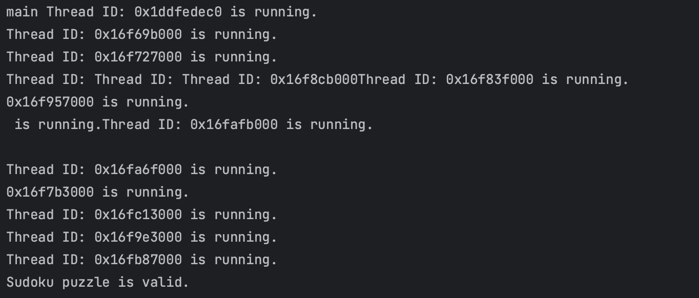
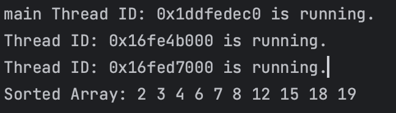

# Project02 Multithreaded Programming

Operating System Homework, Fall 2023

<br />

<div align="center">
  <h3>Multithreaded programming</h3>
  <p>
    21271209 李龙飞
  </p>
  <a href="https://github.com/NimbusLongfei/OS-HW"><strong>探索本实验的仓库 »</strong></a>
  <br />
  <br />
  <a href="https://github.com/NimbusLongfei/OS-HW">查看项目</a>
  ·
  <a href="https://github.com/NimbusLongfei/OS-HW/issues">报告Bug</a>
  <!--made by llf-->
</div>

---

这是一个简单的创建多线程编程验证数独以及排序的程序。


<!-- ```
 文件结构
XXXX1209_XXX
├── READMELAB02.md
├── Lab02.pdf
├── sortmultithread.cpp
└── Sudoku.cpp
``` -->

## 目录
- [Project02 Multithreaded Programming](#project02-multithreaded-programming)
  - [目录](#目录)
  - [程序设计与功能](#程序设计与功能)
  - [环境依赖](#环境依赖)
  - [使用方法](#使用方法)
  - [注意事项](#注意事项)
  - [Summarize the thread control methods provided by Linux](#summarize-the-thread-control-methods-provided-by-linux)
  - [My design of the program](#my-design-of-the-program)
  - [Snapshots of experimental results with analysis](#snapshots-of-experimental-results-with-analysis)
  - [Problems encountered and solution](#problems-encountered-and-solution)
  - [Reference materials](#reference-materials)
  - [My suggestions and comments](#my-suggestions-and-comments)
  - [Code](#code)


## 程序设计与功能

1. **功能**
   
    Part I 的程序是多线程来验证数独问题，通过多线程的方式来设计程序检查一个数独矩阵是否是有效的，就是通过创建11个线程来分别检查数独的每一行、每一列以及9个子矩阵；

    Part II 是设计一个多线程程序来进行排序，在主线程中将序列一分为二之后，创建两个字线程来分别对两个子序列进行排序，最后返回到主程序中来进行合并，得到最终排序好的数组。


2. **设计**

    `Part I`的设计思路如下：
    
    首先需要进行多线程的验证，所以需要在主线程中创建11个线程来分别检查各行、各列和9个子矩阵。所以每个线程都需要访问数独矩阵的数据，因为多个线程是在同一地址空间中运行，所以线程间通信可以通过全局变量，因此将数独矩阵存储为一个全局的二维数组，方便在每一个线程中访问。

    需要编写两个函数，一个用来验证指定起始位置的子矩阵是否有效，一个用来验证各行或者列是否是有效的。需要注意的是函数的参数为指针，同时，向函数传递多个参数需要使用结构体指针，具体到本任务中就是需要传递验证子矩阵的起始的行和列。

    在主程序中通过使用`pthread_create()`函数来创建11个子线程，其中前两个为检验行和列的，之后使用`for`循环来创建9个检验子矩阵的线程，因为主线程需要等待11个子线程执行结束后来判断该数独矩阵是否有效，因此需要等待子线程全部执行结束后主线程才可以继续执行，判断并结束，因此主线程还需要使用`pthread_join()`来连接主线程与其余的子线程。之后主线程根据标识位判断该数独矩阵是否有效，并输出结果。

    **需要注意的是**，这里的所有子线程分别负责整体验证数独是否有效的一个子问题，因此主线程需要根据子线程执行的结果来判断，这里的所有线程之间还需要共享一个信号来作为标志判断，不同于上述的数独矩阵的共享各个子线程只需要读取，不涉及到修改，该信号标志各个子线程需要是可写的。因此需要考虑到临界资源修改的互斥问题。所以在这里使用了`pthread_mutex_t`来进行互斥访问，保证不会因为对于临界资源的修改导致程序出现错误。


    `Part II`的设计思路如下：

    在主线程中需要创建两个子线程分别将子序列进行排序，两个子线程执行的功能是完全相同的，因此编写一个函数进行序列的排序即可，这里使用的是快速排序算法，需要传递给子线程函数的参数是该子线程开始排序的位置。

    该程序也涉及到各个线程之间协调/同步的问题，具体的逻辑为：主线程需要等待两个子线程将子序列排序完成后进行合并得到最终的序列。如果三个线程之间完全彼此独立的运行，那么主线程很可能合并两个子序列时子线程并没有排序完成，得到的结果很可能是错误的，因此此处的主线程也需要和两个子线程进行连接，直到子线程都执行完毕后主线程再进行合并。


## 环境依赖
要编译和运行这个Shell，您需要满足以下环境依赖：
1. C++编译器：需要一个C++编译器来编译C++代码。可以使用`g++`。

2. POSIX标准库：这个程序中使用了POSIX提供的`<pthread.h>`库，并使用了其中提供的一些线程创建、控制的函数，因此要确保操作系统支持该库中的这些函数。

## 使用方法

1. 编译程序：
   
   打开终端并切换到包含代码的目录
   ```bash
   g++ Sudoku.cpp -o sudoku
   g++ sortmultithread.cpp -o sortmultithread
   ```
    这将生成名为`sudoku`和`sortmultithread`的可执行文件
2. 运行程序：

   ```bash
   ./sudoku
   ./sortmultithread
   ```

3. 输出

    `Part I`的`sudoku`会输出对于该数独矩阵的判断结果；

    `Part II`的`sortmultithread`会输出排序好的序列；

## 注意事项

- 如果需要测试其他矩阵需要将`.cpp`文件中的数据更改，具体为：
    - `Part I`：`Sudoku.cpp`中`puzzle`矩阵的值
    - `Part II`：`sortmultithread.cpp`中`unsortedArray`和`N`的值
- 在`Part I`中的信号标志为采用了数组和单个变量两种方式，均可以正常运行
- 程序中可能会有一些限制和错误处理不完善之处。


## Summarize the thread control methods provided by Linux

  Linux提供了多种线程控制方法，主要包括以下几种：

1. **pthread库**：Linux支持POSIX线程，通过pthread库来创建、管理和控制线程。使用pthread库，可以调用pthread_create函数创建线程，pthread_join函数等待线程完成，pthread_detach函数分离线程，pthread_cancel函数取消线程等。这些函数提供了对线程的基本控制和同步。

2. **信号**：Linux中的信号可以用于线程之间的通信和控制。通过向线程发送信号，可以中断线程的执行或执行特定的操作。例如，pthread_kill函数可以在代码中发送信号给线程。

3. **互斥锁（Mutex）**：互斥锁是用于保护共享资源免受多个线程同时访问的工具。Linux提供了pthread_mutex_t结构，可以通过pthread_mutex_lock和pthread_mutex_unlock函数来控制线程对临界区的访问，确保同一时间只有一个线程可以执行。

4. **条件变量（Condition Variable）**：条件变量用于线程之间的协调和同步。Linux中的pthread库提供了pthread_cond_t结构，可以通过pthread_cond_wait、pthread_cond_signal和pthread_cond_broadcast等函数来等待和唤醒线程。

5. **自旋锁（Spinlock）**：自旋锁是一种轻量级的锁，与互斥锁的区别在于，对于互斥锁，如果资源已经被占用，资源申请者只能进入睡眠状态。但是自旋锁不会引起调用者睡眠，如果自旋锁已经被别的执行单元保持，调用者就一直循环在那里看是否该自旋锁的保持者已经释放了锁。Linux中可以使用pthread_spin_init、pthread_spin_lock和pthread_spin_unlock等函数来操作自旋锁。

6. **线程优先级（Thread Priority）**：Linux支持线程优先级，可以通过调整线程的优先级来控制线程的执行顺序。可以使用pthread_setschedparam函数来设置线程的调度参数。

这些线程控制方法可以根据应用程序的需要进行选择和组合，以实现线程之间的协作和同步。不同的方法适用于不同的情况，例如，互斥锁适用于保护共享资源，信号适用于处理异步事件，条件变量适用于等待特定条件的发生等。


## My design of the program


1. **定义常量和数据结构**：
   - `Part I`中，需要定义出数独矩阵各个位置上具体的值以及矩阵的大小、子矩阵的大小，还要定义访问临界资源时需要的互斥锁。还需要定义用于传递参数的结构体。
   - `Part II`中，需要定义出需要排序的序列及其长度。

2. **函数**：
   - `Part I`中，需要定义两个函数，一个用来检查行或者列是否有效，另一个用来检查子矩阵是否有效。
   - `Part II`中，需要定义一个快速排序函数，一个用来创建多线程的函数，一个合并有序子序列的函数。

3. **main函数功能**：
   - `Part I`中，需要创建11个子线程，其中10和11分别用来检查各行和各列是否有效，1-9分别用来检查一个子矩阵是否是有效的。然后在main函数中join主线程与所有的子线程，然后主线程检查标志位是否有改变来判断该数独是否有效。
   - `Part II`中，首先需要主线程来创建两个子线程，然后join连接两个子线程，最后在主线程中将两个排序好的子序列进行合并，类似于归并排序。

  
## Snapshots of experimental results with analysis

    
    为了便于观察是否程序是多线程执行，在每个函数都输出了其线程ID，可以看到一共输出了12个线程ID，所以可以确定该程序在以多线程的方式执行。最后程序输出了验证数独的结果是有效的。
    
    同时可以观察到，在输出线程ID时是乱序的，说明多个线程之间是并发执行的。同时结果是在所有的ID输出之后输出的，因此可以确定join是有效的。



    可以看到输出了三个线程ID，可以判断程序中三个线程在执行，之后程序输出了排序后的结果。

## Problems encountered and solution
下面是本次程序编写过程中思考的一些问题：

1. 线程的创建和退出问题：
   - 使用`pthread_create`函数创建线程，然后使用`pthread_exit`函数退出线程。这是正确的方法，但要确保在适当的地方创建和退出线程。在`main`函数中，正确地创建了线程，并在循环结束后使用`pthread_join`等待线程退出。

2. 互斥锁使用问题：
   - 使用了互斥锁来保护共享的`result`变量，以确保多个线程可以正确地更新它。因为多个线程可能会同时尝试更新`result`。在`checkRowColumn`和`checkSubgrid`函数中正确地使用了互斥锁来保护`result`的访问。

3. 线程参数传递问题：
   - 将线程的参数传递给线程函数，确保在线程函数中正确地解析参数。


## Reference materials

1. **C语言编程文档**：- 网址：[cplusplus.com](http://www.cplusplus.com/reference/clibrary/)

2. **Linux_bash_cheat_sheet-1**：

3. **Abraham-Silberschatz-Operating-System-Concepts-10th-2018**

<!--made by llf-->

## My suggestions and comments

    可以在实验指导中给出测量程序性能的方式，比较多线程编写程序相较于普通的编写程序是否有性能提升。

## Code
`Part I`
```cpp
#include <iostream>
#include <pthread.h>
#include <cstring>
const int N = 9;
int puzzle[N][N] = {
        {5, 3, 4, 6, 7, 8, 9, 1, 2},
        {6, 7, 2, 1, 9, 5, 3, 4, 8},
        {1, 9, 8, 3, 4, 2, 5, 6, 7},
        {8, 5, 9, 7, 6, 1, 4, 2, 3},
        {4, 2, 6, 8, 5, 3, 7, 9, 1},
        {7, 1, 3, 9, 2, 4, 8, 5, 6},
        {9, 6, 1, 5, 3, 7, 2, 8, 4},
        {2, 8, 7, 4, 1, 9, 6, 3, 5},
        {3, 4, 5, 2, 8, 6, 1, 7, 9}
};


typedef struct {
    int index;
    int row;
    int column;
} parameters;
const int SUBGRID_SIZE = 3;
pthread_mutex_t mutex;
int result = 1; // 数独是否有效的标志，默认是1，如果有不符合的情况出现将其置为0
int results[11];

void * checkRowColumn(void *arg);
void * checkSubgrid(void *arg);

int main(void){
    pthread_t tid = pthread_self(); // 获取当前线程的线程ID
//    std::cout << "main Thread ID: " << tid << " is running." << std::endl;
    pthread_t threads[11];
    parameters paradata[11];

    pthread_mutex_init(&mutex, NULL);

    paradata[9].column = -1;
    paradata[9].index = 9;
    paradata[10].row =-1;
    paradata[10].index = 10;

    pthread_create(&threads[9], NULL, checkRowColumn, &paradata[9]);
    pthread_create(&threads[10], NULL, checkRowColumn, &paradata[10]);

    for (int i = 0; i < 3; ++i){
        for (int j = 0; j < 3; ++j) {
            paradata[i*3 + j%3].row = i * 3;
            paradata[i*3 + j%3].column = j * 3;
            paradata[i*3 + j%3].index = i*3 + j%3;
            pthread_create(&threads[i*3 + j%3], NULL, checkSubgrid, &paradata[i*3 + j%3]);
        }
    }
    for (int i = 0; i < 11; i++) {
        pthread_join(threads[i], NULL);
    }
    pthread_mutex_destroy(&mutex);


    // 两种方式二选一即可
//    for(int i = 0; i < 11; i++){
//        if (results[i] == 0){
//            printf("Sudoku puzzle is not valid.");
//            return 0;
//        }
//    }
//    printf("Sudoku puzzle is valid.");

    if (result) {
        printf("Sudoku puzzle is valid.");
    } else {
        printf("Sudoku puzzle is not valid.");
    }

    return 0;
}

void * checkRowColumn(void *arg) {
    pthread_t tid = pthread_self(); // 获取当前线程的线程ID
//    std::cout << "Thread ID: " << tid << " is running." << std::endl;

    parameters * data = (parameters *) arg;
    int id = data->index;
    int row = data->row;
    int col = data->column;
    int seen[N] = {0};

    if (col == -1){//  检查每一行
        for (int i = 0; i < N; ++i) {  // 遍历每一行
            memset(seen, 0, sizeof(seen));
            for (int j = 0; j < N; ++j) {
                int numInRow = puzzle[i][j];
                if (numInRow < 1 || numInRow > N || seen[numInRow - 1]) {
                    pthread_mutex_lock(&mutex);  // 锁定互斥锁
                    result = 0;  // 设定 result 为0
                    pthread_mutex_unlock(&mutex);  // 解锁互斥锁
                    pthread_exit(NULL);
                }
                seen[numInRow - 1] = 1;
            }

        }
    }else if (row == -1){
        for (int i = 0; i < N; ++i) {  // 遍历每一列
            memset(seen, 0, sizeof(seen));
            for (int j = 0; j < N; ++j) {
                int numInCol = puzzle[j][i];
                if (numInCol < 1 || numInCol > N || seen[numInCol - 1]) {
                    pthread_mutex_lock(&mutex);  // 锁定互斥锁
                    result = 0;  // 设定 result 为0
                    pthread_mutex_unlock(&mutex);  // 解锁互斥锁
                    pthread_exit(NULL);
                }
                seen[numInCol - 1] = 1;
            }
        }
    }
    pthread_mutex_lock(&mutex);
    results[id] = 1;
    pthread_mutex_unlock(&mutex);
    pthread_exit(NULL);
}

void *checkSubgrid(void *arg) {
    pthread_t tid = pthread_self(); // 获取当前线程的线程ID
//    std::cout << "Thread ID: " << tid << " is running." << std::endl;

    parameters *data = (parameters *)arg;
    int row = data->row;
    int col = data->column;
    int id = data->index;
    int seen[N] = {0};

    for (int i = 0; i < 3; i++) {
        for (int j = 0; j < 3; ++j) {
            int nowRow = row + i, nowCol = col + j;
            int numInSubgrid = puzzle[nowRow][nowCol];
            if (numInSubgrid < 1 || numInSubgrid > N || seen[numInSubgrid - 1]) {
                pthread_mutex_lock(&mutex);  // 锁定互斥锁
                result = 0;  // 设定 result 为0
                pthread_mutex_unlock(&mutex);  // 解锁互斥锁
                pthread_exit(NULL);
            }
            seen[numInSubgrid - 1] = 1;
        }
    }
    pthread_mutex_lock(&mutex);
    results[id] = 1;
    pthread_mutex_unlock(&mutex);
    pthread_exit(NULL);
}

```

`Part II`
```cpp
#include <iostream>
#include <pthread.h>
using namespace std;

const int N = 10;

int unsortedArray[N] = {7,12,19,3,18,4,2,6, 15,8};
int sortedArray[N];

void quick_sort(int l, int r);
void *sortArray(void *arg);
void mergeArrays();

int main() {
    pthread_t tid = pthread_self(); // 获取当前线程的线程ID
//    std::cout << "main Thread ID: " << tid << " is running." << std::endl;

    pthread_t sortingThreads[2];
    int thread_ids[2] = {0, N/2};

    for (int i = 0; i < 2; i++)
        pthread_create(&sortingThreads[i], NULL, sortArray, &thread_ids[i]);

    for (int i = 0; i < 2; i++)
        pthread_join(sortingThreads[i], NULL);

    mergeArrays();

    cout << "Sorted Array: ";
    for (int i = 0; i < N; i++)
        cout << sortedArray[i] << " ";
    cout << endl;

    return 0;
}

void quick_sort(int l, int r) {
    int *q = unsortedArray;
    if (l >= r)
        return;
    int i = l - 1, j = r + 1, x = q[l + r >> 1];
    while (i < j) {
        do
            i++;
        while (q[i] < x);
        do
            j--;
        while (q[j] > x);
        if (i < j)
            swap(q[i], q[j]);
    }
    quick_sort(l, j);
    quick_sort(j + 1, r);
}

void *sortArray(void *arg) {
    pthread_t tid = pthread_self(); // 获取当前线程的线程ID
//    std::cout << "Thread ID: " << tid << " is running." << std::endl;

    int thread_id = *(int *)arg;
    int start = thread_id;
    int end = start + (N / 2);

    quick_sort(start, end - 1);

    pthread_exit(NULL);
}

void mergeArrays() {
    int i = 0, j = N / 2, k = 0;

    while (i < N / 2 && j < N) {
        if (unsortedArray[i] < unsortedArray[j]) {
            sortedArray[k++] = unsortedArray[i++];
        } else {
            sortedArray[k++] = unsortedArray[j++];
        }
    }

    while (i < N / 2) {
        sortedArray[k++] = unsortedArray[i++];
    }

    while (j < N) {
        sortedArray[k++] = unsortedArray[j++];
    }
}


```