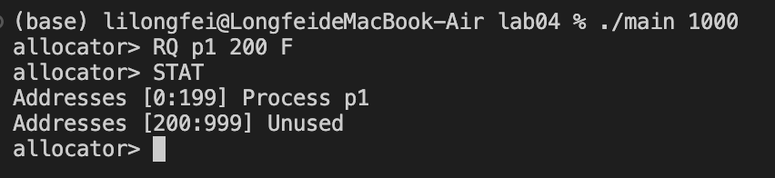
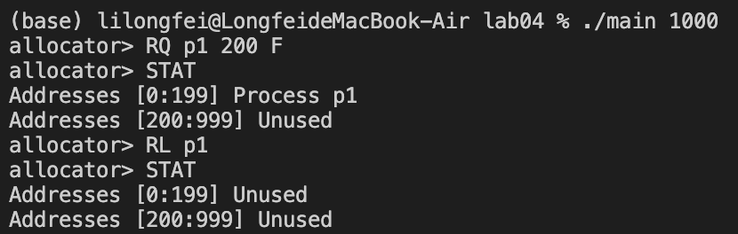
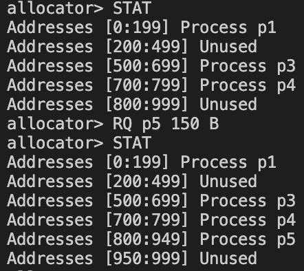
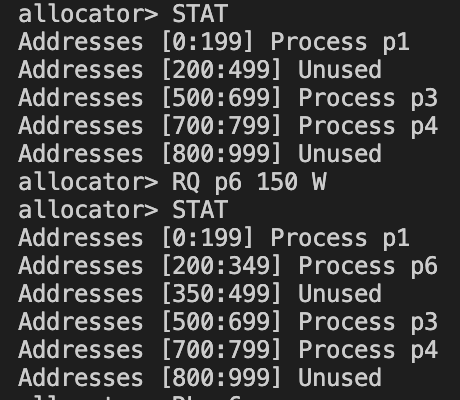
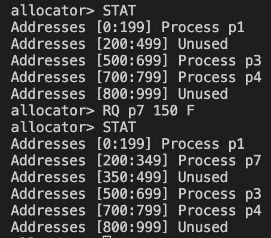
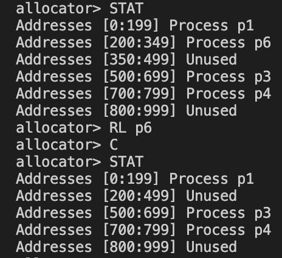

# Project04 Contiguous Memory Allocation

Operating System Homework, Fall 2023

<br />

<div align="center">
  <h3>Contiguous Memory Allocation</h3>
  <p>
    xxxx1209 xxx
  </p>
  <a href="https://github.com/NimbusLongfei/OperatingSystem_HW/tree/main/"><strong>探索本实验的仓库 »</strong></a>
  <br />
  <br />
  <a href="https://github.com/NimbusLongfei/OperatingSystem_HW/tree/main/">查看项目</a>
  ·
  <a href="https://github.com">报告Bug</a>
  <!--made by llf-->
</div>

---

连续内存分配的不同算法


<!-- ```
 文件结构
Lab03
├── READMELAB03.md
├── Lab03.pdf
├── Makefile
├── src
|    ├── pipe.cpp
|    ├── socketpair.cpp
|    └── sharedmemory.cpp
└── text
     ├── big.txt
     ├── ANNA_KARENINA.txt
     ├── anspipe.txt
     ├── anssocketpair.txt
     └── shm.txt
``` -->

## 目录
- [Project04 Contiguous Memory Allocation](#project04-contiguous-memory-allocation)
  - [目录](#目录)
  - [程序设计与功能](#程序设计与功能)
  - [环境依赖](#环境依赖)
  - [使用方法](#使用方法)
- [Report](#report)
  - [My design of the program](#my-design-of-the-program)
  - [Snapshots of experimental results with analysis](#snapshots-of-experimental-results-with-analysis)
  - [Problems encountered and solution](#problems-encountered-and-solution)
  - [Summarize the different memory management methods listed in our textbook](#summarize-the-different-memory-management-methods-listed-in-our-textbook)
  - [Reference materials](#reference-materials)
  - [My suggestions and comments](#my-suggestions-and-comments)
  - [Code](#code)


## 程序设计与功能

这个程序是一个简单的内存分配模拟器。它创建了一个内存分配器`MemoryAllocator`，可以执行以下操作：

1. `RQ <process_name> <memory_size> <strategy>`: 分配内存给一个进程，使用指定的分配策略（F - 首次适应算法，B - 最佳适应算法，W - 最差适应算法）。
2. `RL <process_name>`: 释放一个进程所占用的内存。
3. `C`: 压缩内存，尝试合并相邻的空闲块。
4. `STAT`: 报告当前内存的分配状态。
5. `X`: 退出程序。

在`main`函数中，它首先检查命令行参数以获取内存总大小，然后创建了一个`MemoryAllocator`对象，传入内存总大小。接着调用`allocator.start()`开始命令行交互，等待用户输入命令来执行相应的操作。
   
还编写了makefile文件，通过指定的规则来完成源代码的编译，将源文件编译为目标文件，并最终链接生成可执行文件。同时还提供了清理编译生成的文件的功能。


## 环境依赖
这个程序的环境需要具备以下条件：

1. **操作系统**：支持 POSIX 标准的操作系统，比如 Linux 或类 Unix 系统，包含以下库 `<iostream>`、`<algorithm>`、`<string>`、`<sstream>` 等。

2. **编译器**：需要支持 C++11 标准及以上的编译器，例如 GCC（GNU Compiler Collection）或者 Clang。

3. **内存**：程序使用了动态内存分配和链表操作，需要足够的内存来存储数据和运行程序。具体内存需求取决于程序执行时分配的内存块数量和大小。

4. **GNU Make 工具**：Makefile 是由 GNU Make 工具解析和执行的，因此需要安装 GNU Make。在大多数类 Unix 系统（例如 Linux、macOS）中，GNU Make 通常是默认安装的。

确保满足了这些基本要求后，可以使用支持 C++11 的编译器编译和运行该程序。

## 使用方法

1. 编译程序：
   
   打开终端并切换到包含的目录
   ```bash
   make
   ```
    这将生成名为`main`的可执行文件
2. 运行程序：

   ```bash
   ./main <memory_size>
   ```

3. 输出
    
    程序会输出提示符`allocator>`，可以通过`RQ`，`RL`，`C`，`STAT`来进行连续内存大小为`memory_size`的分配、回收、压缩和内存状态查看。


# Report

## My design of the program

这个程序是一个简单的内存分配模拟器，主要包括以下几个部分：

1. **MemoryAllocator 类**：
   - 创建了一个 `MemoryBlock` 结构体来表示内存块，包含了进程名、起始地址、大小和指向下一个内存块的指针。
   - 使用链表来管理内存块，其中`head`指针指向空闲内存块的链表头，`max_memory_size` 表示总内存大小。
   - `MemoryAllocator` 的构造函数初始化了一个空闲内存块链表，包含了整个可用内存。
   - `allocateMemory` 方法用于根据不同的分配策略（首次适应、最佳适应、最差适应）分配内存给进程。
   - `releaseMemory` 方法释放特定进程占用的内存。
   - `compactMemory` 方法压缩内存，合并相邻的空闲内存块。
   - `reportStatus` 方法报告当前内存的分配情况。
   - `start` 方法启动了一个命令行交互界面，等待用户输入命令来执行相应的操作。

2. **main 函数**：
   - 通过命令行参数传入总内存大小。
   - 创建了一个 `MemoryAllocator` 对象并启动了内存分配器的交互界面。

这个程序允许用户通过命令行界面进行内存分配和释放的模拟，支持不同的分配策略，并提供了对当前内存状态的报告功能。


**Makefile**

`makefile` 文件主要用于编译一个 C++ 项目，并且包含了一些规则和命令，用来完成代码的构建、编译和清理。通过指定的规则来完成源代码的编译，将源文件编译为目标文件，并最终链接生成可执行文件。同时还提供了清理编译生成的文件的功能。

  
## Snapshots of experimental results with analysis

运行程序指定内存大小为1000B，为程序p1申请200B。



释放程序p1的内存。



从图中上状态中可知，当前内存中有两块未使用区域，第一块大小为300B，第二块大小为200B，观察使用不同算法分配150B内存的结果，当前使用的是最佳适应算法，所以将其分配在了内存碎片最小的位置上，也就是最后。



现在使用最坏适应算法，观察程序分配的结果，发现新的进程被分配在了第一块内存区域，符合内存碎片最大的策略。



现在使用最先适应算法，所以分配在第一块内存上。



将相邻的未使用内存压缩合并成一块。

## Problems encountered and solution

在插入和删除链表的时候，当前的节点和前节点更新顺序上出现过问题。

## Summarize the different memory management methods listed in our textbook
内存管理是操作系统中的核心任务之一，它涉及将物理内存分配给多个进程，并对内存进行合理的组织和管理。以下是一些不同的内存管理方法：

1. **单一连续区域管理**：
    - **单一连续区域分配**：整个内存区域被分配给一个进程。这意味着所有进程共享同一块连续的内存空间。
    - **外部碎片**：当多个进程需要内存时，由于内存中存在无法利用的小空间（外部碎片），导致不能有效地分配。
    - **无法使用大型内存**：难以支持大型程序或需要大量内存的任务。
     - 单一连续分配
    
        在单道程序环境下，当时的存储器管理方式是把内存分为系统区和用户区两部分，系统区仅提供给OS使用，它通常是放在内存的低址部分。而在用户区内存中，仅装有一道用户程序，即整个内存的用户空间由该程序独占。这样的存储器分配方式被称为单一连续分配方式。

   - 固定分区分配
    
        将整个用户空间划分为若干个固定大小的区域，在每个分区中只装入一道作业。当有一空闲分区时，便可以再从外存的后备作业队列中选择一个适当大小的作业，装入该分区。当该作业结束时，又可再从后备作业队列中找出另一作业调入该分区。

   - 动态分区分配
        
        根据进程的实际需要，动态地为之分配内存空间。在实现动态分区分配时，将涉及到分区分配中所用的数据结构、分区分配算法和分区的分配与回收操作这样三方面的问题。

   - 基于顺序搜索的动态分区分配算法
    
        将系统中的空闲分区链接成一个链。所谓顺序搜索， 是指依次搜索空闲分区链上的空闲分区，去寻找 一个其大小能满足要求的分区。基于顺序搜索的动态分区分配算法有如下四种:首次适应算法、循环首次适应算法、最佳适应算法和最坏适应算法。

   - 基于索引搜索的动态分区分配算法
    
        当系统很大时，系统中的内存分区可能会很多，相应的空闲分区链就可能很长，这时采用顺序搜索分区方法可能会很慢。为了提高搜索空闲分区的速度，在大、中型系统中往往会采用基于索引搜索的动态分区分配算法，目前常用的有快速适应算法、伙伴系统和哈希算法。

   - 动态可重定位分区分配
     - 紧凑
    
        将内存中的所有作业进行移动，使它们全都相邻接。这样，即可把原来分散的多个空闲小分区拼接成一个大分区，可将一个作业装入该区。这种通过移动内存中作业的位置，把原来多个分散的小分区拼接成一个大分区的方法，称为“拼接”或“紧凑”。

     - 动态重定位
  
        在系统中增设一个重定位寄存器，用它来存放程序(数据)在内存中的起始地址。程序在执行时，真正访问的内存地址是相对地址与重定位寄存器中的地址相加而形成的。

     - 动态重定位分区分配算法

        动态重定位分区分配算法与动态分区分配算法基本上相同，差别仅在于：在这种分配算法中，增加了紧凑的功能。通常，当该算法不能找到一个足够大的空闲分区以满足用户需求时，如果所有的小的空闲分区的容量总和大于用户的要求，这时便须对内存进行“紧凑”，将经“紧凑”后所得到的大空闲分区分配给用户。如果所有的小的空闲分区的容量总和仍小于用户的要求，则返回分配失败信息。


2. **分区管理**：
    - **固定分区**：内存被划分为固定大小的区域，每个区域分配给一个进程。外部碎片的问题仍然存在。
    - **可变分区**：内存被划分为不同大小的区域，根据进程的需求进行动态分配。存在内部和外部碎片问题。

3. **页式存储管理**：
    - **页面大小**：物理内存和虚拟内存被划分为固定大小的页面（通常为 4KB）。
    - **分页**：进程的虚拟地址空间被分割为相同大小的页面，当需要时，页面被映射到物理内存中。
    - **适应性**：有效解决了碎片问题，但可能会出现部分页未充分利用的内部碎片。

4. **段式存储管理**：
    - **段的不同大小**：进程的地址空间分为多个段，每个段具有不同的大小和用途（如代码段、数据段、堆栈段、附加段）。
    - **动态增长**：每个段可以根据需要进行动态增长。

5. **段页式存储管理**：
    - **结合段和页**：将地址空间划分为段，每个段再被划分为页。
    - **优点结合**：结合了分段和分页的优点，提供更好的管理和适应性。

6. **虚拟内存**：
    - **部分加载**：仅将进程的一部分加载到物理内存，其余部分存储在磁盘上。
    - **分页式交换**：根据需要将页面从磁盘交换到内存，以满足进程的要求。
    - **资源利用**：可以支持更大的进程，但是磁盘读写可能成为性能瓶颈。


## Reference materials

1. **C语言编程文档**：- 网址：[cplusplus.com](http://www.cplusplus.com/reference/clibrary/)

2. **Linux_bash_cheat_sheet-1**

3. **Abraham-Silberschatz-Operating-System-Concepts-10th-2018**


<!--made by llf-->

## My suggestions and comments

这个实验帮助理解了连续内存分配的几种策略。


## Code

`Makefile`
```Makefile
CXX = g++
SRC = $(wildcard *.cpp ./src/*.cpp)
OBJ := $(patsubst ./src/%.cpp,./build/%.o,$(SRC))
OBJ := $(patsubst %.cpp,./build/%.o,$(OBJ))
CXXFLAG := -I include -g
TARGET = main
dir_name := ./build

$(shell if [ ! -e $(dir_name) ];then mkdir $(dir_name); fi)
$(TARGET): $(OBJ)
#	echo $(OBJ)
	$(CXX) -o $@ $^ 
./build/%.o: %.cpp
	$(CXX) -o $@ -c $< $(CXXFLAG)

./build/%.o: ./src/%.cpp
	$(CXX) -o $@ -c $< $(CXXFLAG)
.PHONY:clean

clean:
	rm -rf $(TARGET)
	rm -rf $(OBJ)
```


`实验代码`
```cpp
#include <iostream>
#include <algorithm>
#include <string>
#include <sstream>

using namespace std;

// 内存对象
class MemoryAllocator {
private:
    struct MemoryBlock {
        string process_name;
        int start_address;
        int size;
        MemoryBlock* next;
    };

    MemoryBlock* head;   // 内存分配空闲队列头指针
    int max_memory_size; // 内存总大小

public:
    MemoryAllocator(int max_size) {
        /* 初始化内存分配空闲链表*/
        max_memory_size = max_size;
        head = new MemoryBlock(); // 创建第一个空闲块
        head->start_address = 0;
        head->size = max_size;
        head->process_name = "Free";
        head->next = nullptr;
    }

    void allocateMemory(string process, int size, char strategy) {
        MemoryBlock* current = head;
        MemoryBlock* prev = nullptr;
        MemoryBlock* new_block = nullptr;
        bool allocated = false;

        if (strategy == 'F') { // 首次适应算法
            while (current != nullptr) {
                if (current->process_name == "Free" && current->size >= size) {
                    new_block = new MemoryBlock();
                    new_block->process_name = process;
                    new_block->size = size;
                    new_block->start_address = current->start_address;

                    if (prev == nullptr) {
                        head = new_block;
                    } else {
                        prev->next = new_block;
                    }

                    if(current->size == size) {
                        new_block->next = current->next;
                        delete current;
                    } else {
                        new_block->next = current;
                        current->start_address += size;
                        current->size -= size;
                    }

                    allocated = true;
                    break;
                }
                prev = current;  // 记录前一个节点
                current = current->next;  // 移动到下一个节点
            }
        } else if (strategy == 'B') { // 最佳适应算法
            MemoryBlock* best_fit_block = nullptr;
            MemoryBlock* best_fit_prev = nullptr;
            int min_size = max_memory_size + 1;
            current = head;
            prev = nullptr;

            while (current != nullptr) {
                if (current->process_name == "Free" && current->size >= size && current->size < min_size) {
                    best_fit_block = current;
                    best_fit_prev = prev;
                    min_size = current->size;
                }
                prev = current;
                current = current->next;

            }

            if (best_fit_block != nullptr) {
                new_block = new MemoryBlock();
                new_block->process_name = process;
                new_block->size = size;
                new_block->start_address = best_fit_block->start_address;

                if (best_fit_prev == nullptr) {
                    head = new_block;
                } else {
                    best_fit_prev->next = new_block;
                }

                if(best_fit_block->size == size){
                    new_block->next = best_fit_block->next;
                    delete best_fit_block;
                } else {
                    new_block->next = best_fit_block;
                    best_fit_block->start_address += size;
                    best_fit_block->size -= size;
                }

                allocated = true;
            }
        } else if (strategy == 'W') { // 最差适应算法
            MemoryBlock* worst_fit_block = nullptr;
            MemoryBlock* worst_fit_prev = nullptr;
            int max_size = -1;
            current = head;
            prev = nullptr;

            while (current != nullptr) {
                if (current->process_name == "Free" && current->size >= size && current->size > max_size) {
                    worst_fit_block = current;
                    worst_fit_prev = prev;
                    max_size = current->size;
                }
                prev = current;
                current = current->next;
            }

            if (worst_fit_block != nullptr) {
                new_block = new MemoryBlock();
                new_block->process_name = process;
                new_block->size = size;
                new_block->start_address = worst_fit_block->start_address;

                if (worst_fit_prev == nullptr) {
                    head = new_block;
                } else {
                    worst_fit_prev->next = new_block;
                }

                if(worst_fit_block->size == size){
                    new_block->next = worst_fit_block->next;
                    delete worst_fit_block;
                } else {
                    new_block->next = worst_fit_block;
                    worst_fit_block->start_address += size;
                    worst_fit_block->size -= size;
                }

                allocated = true;
            }
        } else {
            cout << "Invalid strategy. Please enter F, B, or W." << endl;
            return;
        }

        if (!allocated) {
            cout << "Error: Insufficient memory to allocate for process " << process << endl;
        }
    }


    void releaseMemory(string process) {
        MemoryBlock* current = head;
        MemoryBlock* prev = nullptr;

        while (current != nullptr) {
            if (current->process_name == process) {
                current->process_name = "Free";

                // 合并相邻空闲块
//                if (prev != nullptr && prev->process_name == "Free") {
//                    prev->size += current->size;
//                    prev->next = current->next;
//                    delete current;
//                    current = prev;
//                }
//
//                if (current->next != nullptr && current->next->process_name == "Free") {
//                    current->size += current->next->size;
//                    MemoryBlock* temp = current->next;
//                    current->next = current->next->next;
//                    delete temp;
//                }
                break;
            }
            prev = current;
            current = current->next;
        }
    }

    void compactMemory() {
        bool f = false;

        while (true) {
            MemoryBlock* current = head;
            f = false;

            while (current != nullptr && current->next != nullptr) {
                if (current->process_name == "Free" && current->next->process_name == "Free") {
                    f = true;
                    current->size += current->next->size;
                    MemoryBlock* temp = current->next;
                    current->next = current->next->next;
                    delete temp;
                }
                current = current->next;
            }

            if (!f) {
                break;
            }
        }
    }


    void reportStatus() {
        MemoryBlock* current = head;
        while (current != nullptr) {
            int end_address = current->start_address + current->size - 1;
            cout << "Addresses [" << current->start_address << ":" << end_address << "] ";

            if (current->process_name == "Free") {
                cout << "Unused" << endl;
            } else {
                cout << "Process " << current->process_name << endl;
            }
            current = current->next;
        }
    }

    void start() {
        string line;
        while (true) {
            cout << "allocator> ";
            getline(cin, line); // 逐行读取输入

            stringstream ss(line);
            string command;
            ss >> command;

            if (command == "RQ") {
                // 处理请求命令
                string process_name;
                int memory_size;
                char strategy;
                ss >> process_name >> memory_size >> strategy;
                allocateMemory(process_name, memory_size, strategy);
            } else if (command == "RL") {
                // 处理释放命令
                string process_name;
                ss >> process_name;
                releaseMemory(process_name);
            } else if (command == "C") {
                // 处理压缩命令
                compactMemory();
            } else if (command == "STAT") {
                // 处理状态报告命令
                reportStatus();
            } else if (command == "X") {
                // 退出程序
                break;
            } else {
                cout << "Invalid command. Please enter RQ, RL, C, STAT, or X." << endl;
            }
        }
    }


};


int main(int argc, char *argv[]) {
    if(argc != 2) {
        cerr << "Usage: "<< argv[0] << " <memory_size>" << endl;
        return 1;
    }

    MemoryAllocator allocator(atoi(argv[1]));

    allocator.start();

    return 0;
}

```