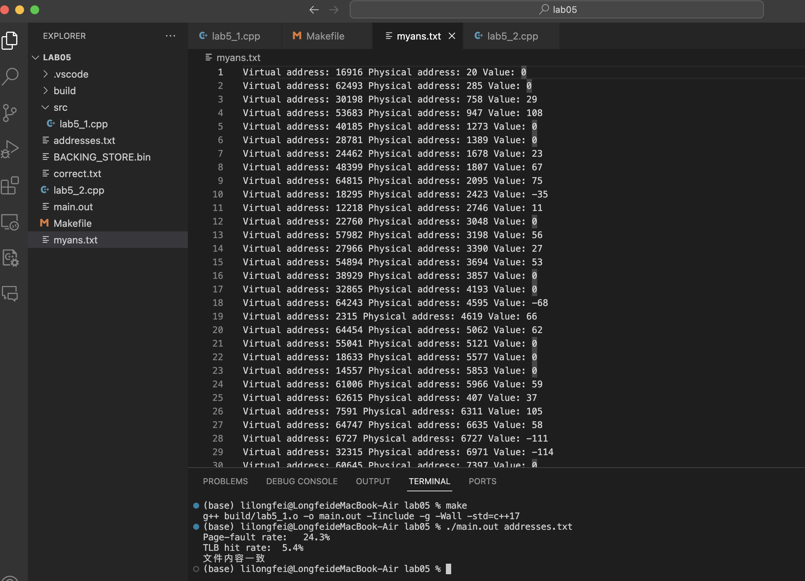

# Project05 A Virtual Memory Manager

Operating System Homework, Fall 2023

<br />

<div align="center">
  <h3>A Virtual Memory Manager</h3>
  <p>
    21271209 李龙飞
  </p>
  <a href="https://github.com/NimbusLongfei/OperatingSystem_HW/tree/main/"><strong>探索本实验的仓库 »</strong></a>
  <br />
  <br />
  <a href="https://github.com/NimbusLongfei/OperatingSystem_HW/tree/main/">查看项目</a>
  ·
  <a href="https://github.com">报告Bug</a>
  <!--made by llf-->
</div>

---

虚拟内存管理的地址翻译和页面置换


<!-- ```
 文件结构
Lab03
├── READMELAB03.md
├── Lab03.pdf
├── Makefile
├── src
|    ├── pipe.cpp
|    ├── socketpair.cpp
|    └── sharedmemory.cpp
└── text
     ├── big.txt
     ├── ANNA_KARENINA.txt
     ├── anspipe.txt
     ├── anssocketpair.txt
     └── shm.txt
``` -->

## 目录
- [Project05 A Virtual Memory Manager](#project05-a-virtual-memory-manager)
  - [目录](#目录)
  - [程序设计与功能](#程序设计与功能)
      - [程序功能](#程序功能)
      - [设计部分](#设计部分)
      - [总结](#总结)
  - [环境依赖](#环境依赖)
  - [使用方法](#使用方法)
- [Report](#report)
  - [My design of the program](#my-design-of-the-program)
    - [1. 数据结构](#1-数据结构)
      - [a. TLB（转换查找缓冲）](#a-tlb转换查找缓冲)
      - [b. 页表（Page Table）](#b-页表page-table)
      - [c. 物理内存](#c-物理内存)
    - [2. 主要功能](#2-主要功能)
      - [a. 地址转换与访问](#a-地址转换与访问)
      - [b. 统计信息输出](#b-统计信息输出)
      - [c. 页面置换策略（第二个版本）](#c-页面置换策略第二个版本)
    - [3. 运行流程](#3-运行流程)
      - [a. 读取地址文件](#a-读取地址文件)
      - [b. 地址转换与页面错误处理](#b-地址转换与页面错误处理)
      - [c. 统计信息与结果输出](#c-统计信息与结果输出)
    - [4. 注意事项](#4-注意事项)
  - [Snapshots of experimental results with analysis](#snapshots-of-experimental-results-with-analysis)
  - [Problems encountered and solution](#problems-encountered-and-solution)
  - [Summarize the different memory management methods listed in our textbook](#summarize-the-different-memory-management-methods-listed-in-our-textbook)
  - [Reference materials](#reference-materials)
  - [My suggestions and comments](#my-suggestions-and-comments)
  - [Code](#code)


## 程序设计与功能

#### 程序功能

该程序旨在模拟虚拟内存管理过程，具体功能包括：

1. **地址转换与访问**
   - 读取包含逻辑地址的文件，将逻辑地址转换为物理地址。
   - 使用TLB和页表进行地址转换，以获取物理地址。
   - 处理TLB命中和页面错误，从磁盘（BACKING_STORE.bin）读取页面数据并存入物理内存。

2. **统计信息输出**
   - 记录并输出页面错误率和TLB命中率。
   - 将结果写入输出文件以供后续验证。

3. **页面置换**
   - 第二个程序版本使用FIFO页面置换算法，确保在物理内存不足时替换适当的页面。

#### 设计部分

1. **数据结构**
   - `tlb[16][2]`：模拟TLB结构，存储页号和对应的物理页号。
   - `page_table[128][2]`：模拟页表结构，存储页号和对应的物理页号。
   - `main_memory[256 * 256]`：模拟物理内存，存储实际数据。

2. **地址转换与访问流程**
   - 读取逻辑地址文件，并对每个逻辑地址进行处理。
   - 提取逻辑地址中的页号和偏移量，然后查询TLB。
   - 如果TLB命中，直接获取物理页号并访问内存；否则查询页表。
   - 处理页表中的页面信息，更新TLB和物理内存。

3. **页面置换策略**
   - 第二个程序版本引入FIFO算法，使用`page_table_time[128]`数组跟踪页面在页表中的停留时间。
   - 当页面错误发生时，使用FIFO算法替换页表中最先进入的页面。

4. **统计信息与结果输出**
   - 统计页面错误率和TLB命中率，并将结果输出至终端。
   - 将逻辑地址、物理地址和对应字节值写入输出文件（"myans.txt"）。
  
#### 总结

该程序通过模拟TLB、页表和物理内存，实现了虚拟内存管理的基本功能。第一个版本实现了基本的地址转换和页面错误处理，而第二个版本引入了FIFO页面置换算法以解决物理内存不足的情况。统计信息输出和结果验证保证了程序的正确性。
   
还编写了`Makefile`文件，通过指定的规则来完成源代码的编译，将源文件编译为目标文件，并最终链接生成可执行文件。同时还提供了清理编译生成的文件的功能。


## 环境依赖

这个程序的运行环境需要具备以下条件：

1. **操作系统**：支持 POSIX 标准的操作系统，例如 Linux 或类 Unix 系统，以确保能够使用相关系统调用和功能。程序使用了 `<iostream>`、`<sys/mman.h>`、`<stdlib.h>`、`<fcntl.h>`、`<stdio.h>`、`<fstream>` 等库。

2. **编译器**：需要支持 C++11 标准及以上的编译器，比如 GCC（GNU Compiler Collection）或 Clang。这些编译器提供对现代 C++特性的支持，确保程序能够正确编译和执行。

3. **内存**：程序需要足够的内存来存储虚拟内存空间、物理内存、TLB、页表等数据结构，以及运行时需要的临时内存。

4. **GNU Make 工具**：包含 Makefile 用于编译和构建，GNU Make 是执行 Makefile 的工具之一。在大多数类 Unix 系统中，GNU Make 通常是默认安装的，确保安装并配置正确。

程序编写了两个版本，第一个版本主要使用了 TLB、页表和物理内存的简单模拟，而第二个版本引入了 FIFO 页面置换算法。在编译和执行程序之前，请确保满足上述环境依赖，并选择合适的编译器和相关工具来构建和运行程序。

## 使用方法

1. 编译程序：
   
   打开终端并切换到包含的目录
   ```bash
   make
   ```
    这将生成名为`main`的可执行文件
2. 运行程序：

   ```bash
   ./main addresses.txt
   ```

3. 输出
    
    程序会在屏幕上输出统计结果，并把结果写入到`myans.txt`中。


# Report

## My design of the program

### 1. 数据结构

#### a. TLB（转换查找缓冲）
- `tlb[16][2]`：模拟 TLB，存储页号和对应的物理页号。
- `tlbindex`：记录 TLB 中当前有效条目的数量。

#### b. 页表（Page Table）
- `page_table[256][2]`（第一个版本）：模拟页表，存储页号和对应的物理页号。
- `page_table[128][2]`（第二个版本）：模拟页表，存储页号和对应的物理页号。
- `page_table_time[128]`（第二个版本）：记录页面在页表中停留的时间，用于 FIFO 页面置换算法。

#### c. 物理内存
- `main_memory[256 * 256]`：模拟物理内存，存储实际数据。

### 2. 主要功能

#### a. 地址转换与访问
1. 读取地址文件，将逻辑地址转换为物理地址。
2. 使用 TLB 和页表进行地址转换，以获取物理地址。
3. 处理 TLB 命中和页面错误，从磁盘（BACKING_STORE.bin）读取页面数据并存入物理内存。

#### b. 统计信息输出
1. 记录并输出页面错误率和 TLB 命中率。
2. 将结果写入输出文件以供后续验证。

#### c. 页面置换策略（第二个版本）
1. 每次循环，`page_table_time` 数组中的所有条目递增，表示页面在页表中停留的时间增加。
2. 当页面错误发生时，优先选择最先进入页表的页面进行替换。

### 3. 运行流程

#### a. 读取地址文件
1. 打开地址文件，逐行读取逻辑地址。
2. 对每个逻辑地址提取页号和偏移量，并进行地址转换。

#### b. 地址转换与页面错误处理
1. 查询 TLB，处理 TLB 命中和未命中的情况。
2. 如果 TLB 未命中，则查询页表，处理页面错误，并更新 TLB 和物理内存。

#### c. 统计信息与结果输出
1. 计算页面错误率和 TLB 命中率，输出至终端。
2. 将逻辑地址、物理地址和对应字节值写入输出文件（"myans.txt"）。

### 4. 注意事项

1. 页面置换部分使用了 FIFO 算法，在物理内存不足时会进行页面替换。
2. 程序运行需要足够的内存空间来存储虚拟内存、物理内存等数据结构，确保运行环境有足够的内存资源。


**Makefile**

`makefile` 文件主要用于编译一个 C++ 项目，并且包含了一些规则和命令，用来完成代码的构建、编译和清理。通过指定的规则来完成源代码的编译，将源文件编译为目标文件，并最终链接生成可执行文件。同时还提供了清理编译生成的文件的功能。

  
## Snapshots of experimental results with analysis



程序输出了`Page-fault rate`和`TLB hit rate`以及程序输出文件和`correct.txt`文件的比对结果。


## Problems encountered and solution

*实验中经常遇到段错误*

*读取bin文件时，需要从文件指定位置开始读，所以与之前读取文件的方式不太相同，需要使用`fseek`函数来调整文件指针。*


## Summarize the different memory management methods listed in our textbook
内存管理是操作系统中的核心任务之一，它涉及将物理内存分配给多个进程，并对内存进行合理的组织和管理。以下是一些不同的内存管理方法：

1. **单一连续区域管理**：
    - **单一连续区域分配**：整个内存区域被分配给一个进程。这意味着所有进程共享同一块连续的内存空间。
    - **外部碎片**：当多个进程需要内存时，由于内存中存在无法利用的小空间（外部碎片），导致不能有效地分配。
    - **无法使用大型内存**：难以支持大型程序或需要大量内存的任务。
     - 单一连续分配
    
        在单道程序环境下，当时的存储器管理方式是把内存分为系统区和用户区两部分，系统区仅提供给OS使用，它通常是放在内存的低址部分。而在用户区内存中，仅装有一道用户程序，即整个内存的用户空间由该程序独占。这样的存储器分配方式被称为单一连续分配方式。

   - 固定分区分配
    
        将整个用户空间划分为若干个固定大小的区域，在每个分区中只装入一道作业。当有一空闲分区时，便可以再从外存的后备作业队列中选择一个适当大小的作业，装入该分区。当该作业结束时，又可再从后备作业队列中找出另一作业调入该分区。

   - 动态分区分配
        
        根据进程的实际需要，动态地为之分配内存空间。在实现动态分区分配时，将涉及到分区分配中所用的数据结构、分区分配算法和分区的分配与回收操作这样三方面的问题。

   - 基于顺序搜索的动态分区分配算法
    
        将系统中的空闲分区链接成一个链。所谓顺序搜索， 是指依次搜索空闲分区链上的空闲分区，去寻找 一个其大小能满足要求的分区。基于顺序搜索的动态分区分配算法有如下四种:首次适应算法、循环首次适应算法、最佳适应算法和最坏适应算法。

   - 基于索引搜索的动态分区分配算法
    
        当系统很大时，系统中的内存分区可能会很多，相应的空闲分区链就可能很长，这时采用顺序搜索分区方法可能会很慢。为了提高搜索空闲分区的速度，在大、中型系统中往往会采用基于索引搜索的动态分区分配算法，目前常用的有快速适应算法、伙伴系统和哈希算法。

   - 动态可重定位分区分配
     - 紧凑
    
        将内存中的所有作业进行移动，使它们全都相邻接。这样，即可把原来分散的多个空闲小分区拼接成一个大分区，可将一个作业装入该区。这种通过移动内存中作业的位置，把原来多个分散的小分区拼接成一个大分区的方法，称为“拼接”或“紧凑”。

     - 动态重定位
  
        在系统中增设一个重定位寄存器，用它来存放程序(数据)在内存中的起始地址。程序在执行时，真正访问的内存地址是相对地址与重定位寄存器中的地址相加而形成的。

     - 动态重定位分区分配算法

        动态重定位分区分配算法与动态分区分配算法基本上相同，差别仅在于：在这种分配算法中，增加了紧凑的功能。通常，当该算法不能找到一个足够大的空闲分区以满足用户需求时，如果所有的小的空闲分区的容量总和大于用户的要求，这时便须对内存进行“紧凑”，将经“紧凑”后所得到的大空闲分区分配给用户。如果所有的小的空闲分区的容量总和仍小于用户的要求，则返回分配失败信息。


2. **分区管理**：
    - **固定分区**：内存被划分为固定大小的区域，每个区域分配给一个进程。外部碎片的问题仍然存在。
    - **可变分区**：内存被划分为不同大小的区域，根据进程的需求进行动态分配。存在内部和外部碎片问题。

3. **页式存储管理**：
    - **页面大小**：物理内存和虚拟内存被划分为固定大小的页面（通常为 4KB）。
    - **分页**：进程的虚拟地址空间被分割为相同大小的页面，当需要时，页面被映射到物理内存中。
    - **适应性**：有效解决了碎片问题，但可能会出现部分页未充分利用的内部碎片。

4. **段式存储管理**：
    - **段的不同大小**：进程的地址空间分为多个段，每个段具有不同的大小和用途（如代码段、数据段、堆栈段、附加段）。
    - **动态增长**：每个段可以根据需要进行动态增长。

5. **段页式存储管理**：
    - **结合段和页**：将地址空间划分为段，每个段再被划分为页。
    - **优点结合**：结合了分段和分页的优点，提供更好的管理和适应性。

6. **虚拟内存**：
    - **部分加载**：仅将进程的一部分加载到物理内存，其余部分存储在磁盘上。
    - **分页式交换**：根据需要将页面从磁盘交换到内存，以满足进程的要求。
    - **资源利用**：可以支持更大的进程，但是磁盘读写可能成为性能瓶颈。

## Reference materials

1. **C语言编程文档**：- 网址：[cplusplus.com](http://www.cplusplus.com/reference/clibrary/)

2. **Linux_bash_cheat_sheet-1**

3. **Abraham-Silberschatz-Operating-System-Concepts-10th-2018**


<!--made by llf-->

## My suggestions and comments

对于物理地址和逻辑地址的翻译关系不太理解。


## Code

`Makefile`
```Makefile
CXX = g++
SRC = $(wildcard *.cpp ./src/*.cpp)
OBJ := $(patsubst ./src/%.cpp,./build/%.o,$(SRC))
OBJ := $(patsubst %.cpp,./build/%.o,$(OBJ))
CXXFLAG := -I include -g
TARGET = main
dir_name := ./build

$(shell if [ ! -e $(dir_name) ];then mkdir $(dir_name); fi)
$(TARGET): $(OBJ)
#	echo $(OBJ)
	$(CXX) -o $@ $^ 
./build/%.o: %.cpp
	$(CXX) -o $@ -c $< $(CXXFLAG)

./build/%.o: ./src/%.cpp
	$(CXX) -o $@ -c $< $(CXXFLAG)
.PHONY:clean

clean:
	rm -rf $(TARGET)
	rm -rf $(OBJ)
```


`实验代码 Lab05_1`
```cpp
#include <iostream>
#include <sys/mman.h>
#include <stdlib.h>
#include <fcntl.h>
#include <stdio.h>
#include <fstream>

using namespace std;

int tlbindex = 0;
unsigned char tlb[16][2];
unsigned char page_table[256][2];   // logical page ---> physical page
signed char main_memory[256 * 256]; // physical memory

int pagefault_num = 0, tlbhit_num = 0;

bool compareFiles(const std::string& file1, const std::string& file2);

int main(int argc, char *argv[]){
    if(argc != 2){
        cout << "Usage: ./lab5_1 <address file>" << endl;
        return 0;
    }

    FILE *address_file = fopen(argv[1], "r");
    FILE *output = fopen("myans.txt", "w");


    char buf[10];
    int init = 0;
    while(fgets(buf, 10, address_file)) {
        int logiadd = atoi(buf);
        int offset = logiadd & 0xFF;
        int logipage = (logiadd >> 8) & 0xFF;
        int physpage = -1;

        bool tlbhit = false;
        for (int i = 0; i < 16; i++) {
            if (tlb[i][0] == logipage) {
                physpage = tlb[i][1];
                tlbhit = true;
                tlbhit_num+=1;

            	fprintf(output, "Virtual address: %d Physical address: %d Value: %d\n", logiadd, (physpage << 8)|offset, main_memory[physpage * 256 + offset]);
                break;
            }
        }
        if (tlbhit){
            continue;
        }

        for (int i = 0; i < 256; i++) {
            if (page_table[i][0] == logipage) {
                physpage = page_table[i][1];
                tlb[tlbindex % 16][0] = logipage;
                tlb[tlbindex % 16][1] = physpage;
                tlbindex++;
                break;
            }
        }
        if (physpage == -1) {
            pagefault_num++ ;
            physpage = init++;
            // 从backing store中读取，并存入page_table和tlb以及main_memory
           FILE *backing_store = fopen("BACKING_STORE.bin", "rb");
           fseek(backing_store, logipage * 256, SEEK_SET);
           fread(main_memory + physpage * 256, 1, 256, backing_store);
           fclose(backing_store);

           fprintf(output, "Virtual address: %d Physical address: %d Value: %d\n", logiadd, (physpage << 8)|offset, main_memory[physpage * 256 + offset]);

            // 更新page_table
            page_table[logipage][0] = logipage;
            page_table[logipage][1] = physpage;

            // 更新tlb
            tlb[tlbindex % 16][0] = logipage;
            tlb[tlbindex % 16][1] = physpage;
            tlbindex++;
        } else {
            fprintf(output, "Virtual address: %d Physical address: %d Value: %d\n", logiadd, (physpage << 8)|offset, main_memory[physpage * 256 + offset]);
        }
    }
    fclose(address_file);
    fclose(output);

    cout << "Page-fault rate:   " << pagefault_num / 10.0 << "%\n";
    cout << "TLB hit rate:  " << tlbhit_num / 10.0 << "%" << endl;

    string file1 = "myans.txt";
    string file2 = "correct.txt";

    if (compareFiles(file1, file2)) {
        cout << "文件内容不同\n";
    } else {
        cout << "文件内容一致\n";
    }

    return 0;
}


bool compareFiles(const string& file1, const string& file2) {
    ifstream stream1(file1), stream2(file2);
    string line1, line2;
    int f = 0;
    // 逐行读取文件内容，并进行比较
    while (getline(stream1, line1) && getline(stream2, line2)) {
        if (line1 != line2) {
            f = 1;
        }
    }

    if(f == 1){
        return false;
    }

    return true;
}

```

`实验代码Lab05_2`
```cpp
#include <iostream>
#include <sys/mman.h>
#include <stdlib.h>
#include <fcntl.h>
#include <stdio.h>
#include <fstream>

using namespace std;
// 用于存储tlb和page_table的数组
int tlbindex = 0;
unsigned char tlb[16][2];
unsigned char page_table[128][2];   // logical page ---> physical page
signed char main_memory[256 * 256]; // physical memory

// 使用FIFO算法，每次替换最先进入的页
int page_table_time[128];
int pagefault_num = 0, tlbhit_num = 0;


int main(int argc, char *argv[]){
    if(argc != 2){
        cout << "Usage: ./lab5_1 <address file>" << endl;
        return 0;
    }

    // 读取地址文件
    FILE *address_file = fopen(argv[1], "r");
    FILE *output = fopen("myans.txt", "w");

    // 初始化tlb和page_table
    for(int i = 0; i < 128; i++) {
        for(int j = 0; j < 2; j++) {
            page_table[i][j] = -1;
        }
    }

    char buf[10];
    int init = 0;
    // 读取地址文件中的地址
    while(fgets(buf, 10, address_file)) {
        // 更新page_table_time
        for(int i = 0; i < 128; i++){
            if(page_table[i][0] != -1){
                page_table_time[i]++;
            }
        }

        int logiadd = atoi(buf);
        int offset = logiadd & 0xFF;
        int logipage = (logiadd >> 8) & 0xFF;
        int physpage = -1;

        bool tlbhit = false;
        for (int i = 0; i < 16; i++) {
            if (tlb[i][0] == logipage) {
                physpage = tlb[i][1];
                tlbhit = true;
                tlbhit_num++;
            	fprintf(output, "Virtual address: %d Physical address: %d Value: %d\n", logiadd, (physpage << 8)|offset, main_memory[physpage * 256 + offset]);
                break;
            }
        }
        if (tlbhit){
            continue;
        }

        for (int i = 0; i < 128; i++) {
            if (page_table[i][0] == logipage) {
                physpage = page_table[i][1];
                tlb[tlbindex % 16][0] = logipage; // 更新tlb
                tlb[tlbindex % 16][1] = physpage;
                tlbindex++;
                break;
            }
        }
        if (physpage == -1) {
            pagefault_num++ ;
            physpage = init++;
            // 从backing store中读取，并存入page_table和tlb以及main_memory
           FILE *backing_store = fopen("BACKING_STORE.bin", "rb");
           fseek(backing_store, logipage * 256, SEEK_SET);
           fread(main_memory + physpage * 256, 1, 256, backing_store);
           fclose(backing_store);

           fprintf(output, "Virtual address: %d Physical address: %d Value: %d\n", logiadd, (physpage << 8)|offset, main_memory[physpage * 256 + offset]);

            // 更新page_table
            int update_f = 0;
            for(int i = 0; i < 128; i++){
                if(page_table[i][0] == -1){
                    page_table[i][0] = logipage;
                    page_table[i][1] = physpage;
                    page_table_time[i] = 0;
                    update_f = 1;
                    break;
                }
            }
            if(update_f == 0){
                int max_time = 0;
                int max_index = 0;
                for(int i = 0; i < 128; i++){
                    if(page_table_time[i] > max_time){
                        max_time = page_table_time[i];
                        max_index = i;
                    }
                }
                page_table[max_index][0] = logipage;
                page_table[max_index][1] = physpage;
                page_table_time[max_index] = 0;
            }

            // 更新tlb
            tlb[tlbindex % 16][0] = logipage;
            tlb[tlbindex % 16][1] = physpage;
            tlbindex++;
        } else {
            fprintf(output, "Virtual address: %d Physical address: %d Value: %d\n", logiadd, (physpage << 8)|offset, main_memory[physpage * 256 + offset]);
        }
    }
    fclose(address_file);
    fclose(output);

    cout << "Page-fault rate:   " << pagefault_num / 10.0 << "%\n";
    cout << "TLB hit rate:  " << tlbhit_num / 10.0 << "%" << endl;

    return 0;
}
```