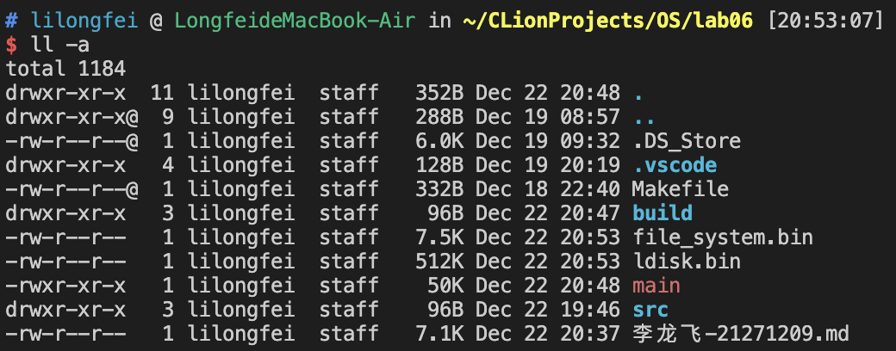
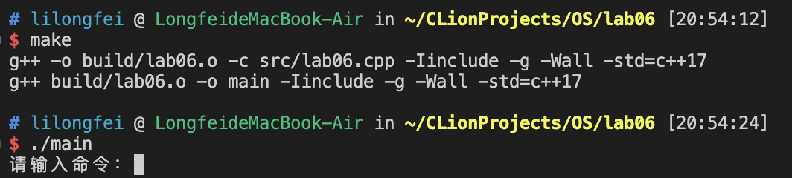
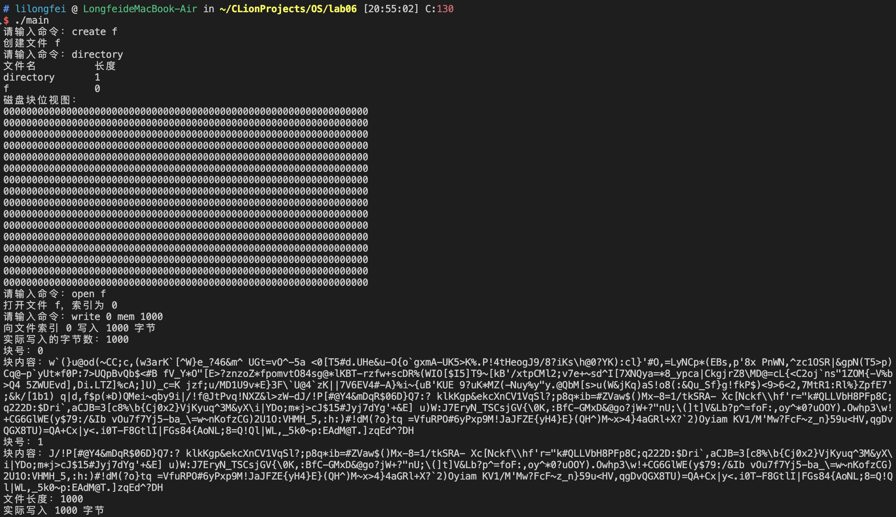
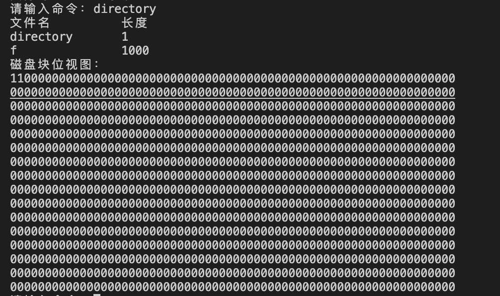
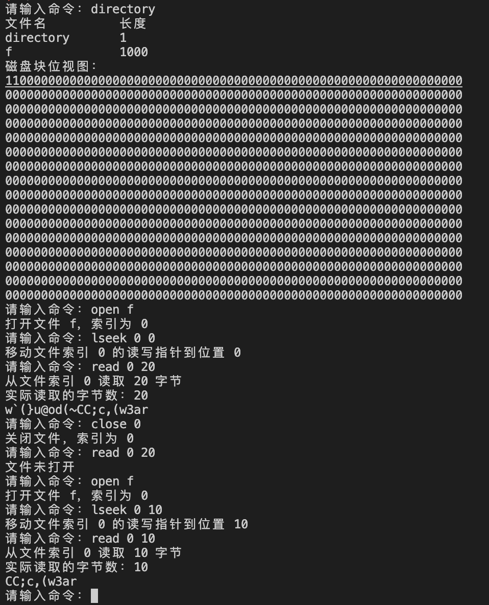
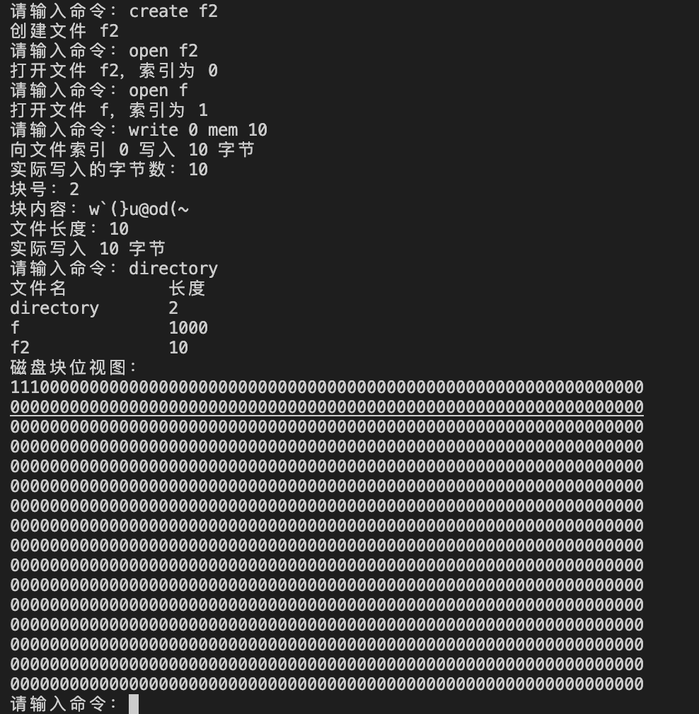
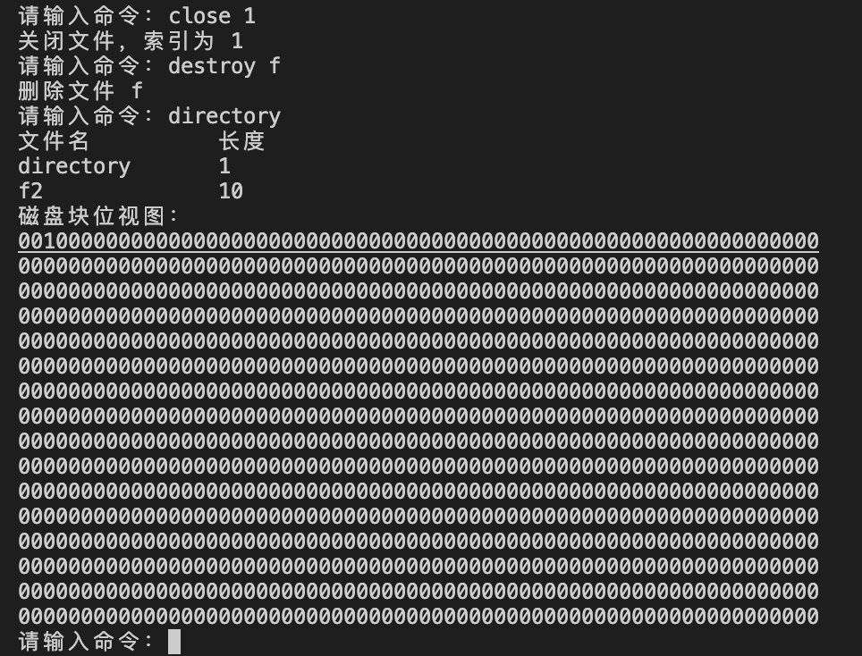
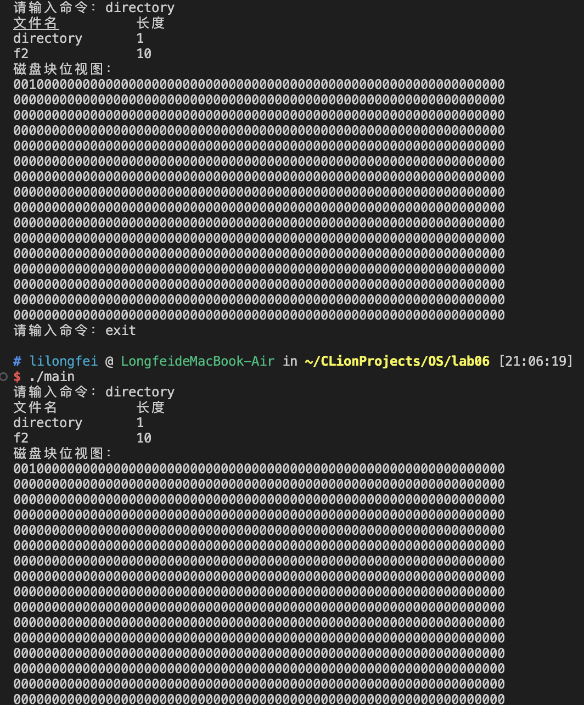

# Project06 文件系统模拟

Operating System Homework, Fall 2023

<br />

<div align="center">
  <h3>文件系统模拟</h3>
  <p>
    21271209 李龙飞
  </p>
  <a href="https://github.com/NimbusLongfei/OperatingSystem_HW/tree/main/"><strong>探索本实验的仓库 »</strong></a>
  <br />
  <br />
  <a href="https://github.com/NimbusLongfei/OperatingSystem_HW/tree/main/">查看项目</a>
  ·
  <a href="https://github.com">报告Bug</a>
  <!--made by llf-->
</div>

---
该实验是在假设的 I/O 系统之上开发一个简单的文件系统，可以通过 create, open, read 等命令与文件系统交互，执行不同的文件操作。文件系统把磁盘视为顺序编号的逻辑块序列，逻辑块的编号为 0 至 L-1。这里的I/O系统利用内存中的数组来模拟磁盘。同时还会把文件系统和模拟的磁盘存储保存下来，可以重复使用。


## 目录
- [Project06 文件系统模拟](#project06-文件系统模拟)
  - [目录](#目录)
  - [程序设计与功能](#程序设计与功能)
  - [环境依赖](#环境依赖)
  - [使用方法](#使用方法)
- [Report](#report)
  - [My design of the program](#my-design-of-the-program)
  - [Snapshots of experimental results with analysis](#snapshots-of-experimental-results-with-analysis)
  - [Problems encountered and solution](#problems-encountered-and-solution)
  - [Reference materials](#reference-materials)
  - [My suggestions and comments](#my-suggestions-and-comments)
  - [Code](#code)


## 程序设计与功能

程序的主要功能和设计可以分为以下几个关键部分：

### 1. 磁盘模拟
- **数组模拟磁盘（ldisk）**：使用一个二维字符数组来模拟磁盘。每个元素代表磁盘上的一个块，其大小为512字节。
- **磁盘块位视图（disk_bitmap）**：一个整型数组，用于表示哪些磁盘块是已分配的。这是用来管理磁盘空间的一种方式。

### 2. 文件描述符
- **文件描述符结构（file_descriptor）**：用于保存文件信息，包括文件名、文件长度和指向磁盘块的指针数组。
- **文件描述符数组（fds）**：存储多个文件描述符，模拟文件系统中的文件目录。
其中文件描述符的第一个是目录文件，其长度为该目录下文件的数量。

### 3. 打开文件表
- **打开文件表结构（open_file）**：用于跟踪当前打开的文件，包含文件描述符的索引和读写指针。
- **打开文件表数组（open_files）**：存储维护当前已经打开文件的信息。

### 4. I/O 系统
- **读写磁盘块函数**：包括读取（read_block）和写入（write_block）磁盘块的函数。

### 5. 保存和恢复磁盘内容
- **保存和恢复磁盘内容函数**：包括将ldisk数组的内容保存到文件（save_ldisk_to_file）和从文件恢复内容到ldisk数组（restore_ldisk_from_file）的函数。
- **保存和恢复文件系统函数**：将文件系统中的文件描述符数组（fds）和位视图（disk_bitmap）保存到文件中。

### 6. 文件系统操作
- **创建（create）**：在文件描述符数组中添加一个新的文件描述符。
- **销毁（destroy）**：从文件描述符数组中移除一个文件描述符。
- **打开（open）**：在打开文件表中添加一个条目，以访问文件。
- **关闭（close）**：从打开文件表中移除一个条目。
- **读取（read）**：从文件中读取数据到内存。
- **写入（write）**：将内存中的数据写入文件。
- **移动读写指针（lseek）**：更改文件中的当前读写位置。
- **目录（directory）**：显示当前文件系统中的所有文件。

### 7. 用户交互
- **命令解析**：从用户输入中解析出具体的文件操作命令，并执行相应的文件系统操作。

### 8. 其他功能
- **初始化**：在程序开始时，初始化所有的结构和数组。
- **内存区域（mem_area）**：用于暂存从文件读取的数据或准备写入文件的数据。
- **缓冲区（buffer）**：用于文件读写操作的临时存储。

### 设计注意点
- **错误处理**：确保在各种操作中，如文件无法创建或打开、磁盘空间不足等情况下，能够妥善处理错误。
- **数据持久性**：确保文件系统的状态（包括文件描述符和磁盘内容）能够在程序退出后保存，并在下次启动时恢复。
   
还编写了makefile文件，通过指定的规则来完成源代码的编译，将源文件编译为目标文件，并最终链接生成可执行文件。同时还提供了清理编译生成的文件的功能。


## 环境依赖
这个程序的环境需要具备以下条件：

1. **操作系统**：支持 POSIX 标准的操作系统，比如 Linux 或类 Unix 系统，包含以下库 `<iostream>`、`<algorithm>`、`<string>`、`<sstream>` 等。

2. **编译器**：需要支持 C++11 标准及以上的编译器，例如 GCC（GNU Compiler Collection）或者 Clang。

3. **内存**：程序使用了动态内存分配和链表操作，需要足够的内存来存储数据和运行程序。具体内存需求取决于程序执行时分配的内存块数量和大小。

4. **GNU Make 工具**：Makefile 是由 GNU Make 工具解析和执行的，因此需要安装 GNU Make。在大多数类 Unix 系统（例如 Linux、macOS）中，GNU Make 通常是默认安装的。

确保满足了这些基本要求后，可以使用支持 C++11 的编译器编译和运行该程序。

## 使用方法

1. 编译程序：
   
   打开终端并切换到包含`/src/lab06.cpp`的目录
   ```bash
   make
   ```
    这将生成名为`main`的可执行文件
2. 运行程序：

   ```bash
   ./main
   ```

3. 输出
    
    程序会输出提示符`请输入命令`，可以通过create、open、read、close、write等命令来进行文件系统的操作。

# Report

## My design of the program

### 1. 
本实验的目的是设计并实现一个简单的文件系统，该系统在一个假设的I/O系统之上运行，利用内存中的数组来模拟磁盘。主要实现文件的创建、销毁、打开、关闭、读取、写入、指针移动和目录查看等基本操作。

### 2. 设计思路

#### 2.1 系统架构
本文件系统的设计基于以下几个核心组件：
- **模拟磁盘（ldisk）**：使用二维字符数组模拟磁盘空间。
- **文件描述符（fds）**：存储文件元数据，包括文件名、长度和所占用的磁盘块。
- **打开文件表（open_files）**：跟踪当前打开的文件和读写状态。
- **磁盘块位视图（disk_bitmap）**：追踪磁盘块的分配情况。

#### 2.2 数据结构
详细定义了每个组件的数据结构：
- **ldisk**：用于模拟磁盘的二维数组。
- **file_descriptor**：包含文件名、文件长度、占用的磁盘块编号。
- **open_file**：包含文件描述符的索引和读写指针。
- **disk_bitmap**：一个整型数组，标记每个磁盘块的分配状态。

#### 2.3 功能实现
功能实现分为以下几个部分：
- **文件操作**：包括创建、销毁、打开、关闭文件。
- **读写操作**：从文件读取数据到内存，以及将内存中的数据写入文件。
- **指针移动**：在文件中移动读写指针。
- **目录操作**：展示当前文件系统中的文件列表。

### 3. 功能实现细节

#### 3.1 初始化
系统启动时，初始化所有数据结构，包括ldisk、fds、open_files和disk_bitmap。

如果此前程序已经保存过了文件系统和磁盘的内容，就会从磁盘上恢复ldisk、disk_bitmap、fds，来保证程序的数据延续。

#### 3.2 文件创建与销毁
- **创建（create）**：在文件描述符数组中分配一个新条目，并设置文件名和初始长度。需要注意，创建文件并不会直接分配磁盘块，等到实际需要磁盘块的时候才会进行分配。
- **销毁（destroy）**：在文件描述符数组中释放指定文件的条目，并更新磁盘块位视图。另外需要注意的是要把分配的磁盘块释放，并将disk_bitmap进行释放，否则会造成资源的占用，在这里应该就是磁盘泄漏。

#### 3.3 文件打开与关闭
- **打开（open）**：在打开文件表中为文件创建一个新条目，存储文件描述符索引和初始化读写指针。其实打开文件就只是在打开文件表中添加一项并返回描述符，并不会分配磁盘空间。
- **关闭（close）**：从打开文件表中移除指定文件的条目。

#### 3.4 文件读写
- **读（read）**：根据打开文件的读写指针和文件描述符，从ldisk中读取数据到内存。
- **写（write）**：将内存中的数据写入ldisk，根据需要分配新的磁盘块。
- 读写这里存在两个需要注意的点，一个是读写指针所在的位置需要提前使用`lseek`进行指定，另一个是如果没有在操作读写之前先打开文件，无法操作文件。

#### 3.5 文件指针操作
- **指针移动（lseek）**：在文件中移动读写指针，以便读写操作可以从文件的不同位置开始。

#### 3.6 目录操作
- **目录（directory）**：遍历文件描述符数组，展示所有文件的名称和大小，并且会打印出磁盘的位视图，便于观察分配磁盘块是否正确。需要注意的是，目录是一种特殊的文件，它的长度是目录中的文件的个数。

#### 3.7 I/O系统
- **读写磁盘块**：实现用于读取和写入模拟磁盘的函数。
- **持久化**：实现函数以将ldisk、位视图和文件系统的状态保存到文件，并在程序启动时从文件中恢复这些状态。

#### 3.8 用户交互
- **命令行界面**：提供一个循环，从用户处接收命令并调用相应的文件操作函数。
- **命令解析**：解析用户输入的命令，执行相应的文件操作。

### 4. 总结
本实验通过模拟一个简单的文件系统，加深了对文件系统结构和操作的理解。实验涵盖了文件系统的基本功能，如文件的创建、销毁、读写和管理，以及磁盘空间的分配和管理。


**Makefile**

`makefile` 文件主要用于编译一个 C++ 项目，并且包含了一些规则和命令，用来完成代码的构建、编译和清理。通过指定的规则来完成源代码的编译，将源文件编译为目标文件，并最终链接生成可执行文件。同时还提供了清理编译生成的文件的功能。

  
## Snapshots of experimental results with analysis

运行该代码的方式如上图所示，将`Makefile`文件放在和`src`文件夹同级目录下。


然后输入`make`进行编译，产生可执行文件`main`。



执行基本命令`create`和`directory`，进行创建文件和查看当前目录，发现目录的文件长度为1，且刚创建的空文件的长度为0，程序执行正确。

然后使用`open`打开文件并执行`write`来向文件中写入1000个字节指定位置mem的内容。这里程序显示写了两个磁盘块，并输出显示每个块中存放的字符。

程序输出显示正确。


由于磁盘中每块512字节，所以在当前的文件的位视图显示该文件占用了两个磁盘块。


这张截图中主要展示了`lseek`以及`close`命令的使用。

首先是`lseek`命令，可以将文件的读写指针进行重置。如上图中，首先将读写指针放在0的位置，然后读取20个字符；接着将文件的读写索引指针放在位置10，然后读取10个字符，发现该十个字符就是第一次读取的20个字符的后十个。

接着是`close`命令，在该图片中，关闭文件对应的索引后，使用`read`命令读取文件显示未打开。说明程序的打开文件表设计正确。


这张图片展示创建第二个文件并将两个文件都打开进行写入，并显示当前的磁盘位视图以及目录中的文件的状态。第一个文件占用了两个磁盘块，第二个文件占用了一个磁盘块，一共占用了两个磁盘块。程序执行正确。


这张照片显示使用`destroy`命令删除文件的执行情况，文件状态正确，并且磁盘位视图显示的释放情况也正确。



该图显示使用`exit`命令结束程序后，重新运行程序，文件系统和磁盘位视图的保存和复原能够正常运行。

## Problems encountered and solution

程序编写过程中使用到了多种数据结构，在编写功能函数时遇到变量更新不完全，导致输出的信息错误。

解决办法：仔细根据程序流程图检查各变量更新情况。


## Reference materials

1. **C语言编程文档**：- 网址：[cplusplus.com](http://www.cplusplus.com/reference/clibrary/)

2. **Linux_bash_cheat_sheet-1**

3. **Abraham-Silberschatz-Operating-System-Concepts-10th-2018**


<!--made by llf-->

## My suggestions and comments

该实验帮助理解了文件系统的概念，但是对于不同文件系统的使用还是不够理解。


## Code

`Makefile`
```Makefile
TARGET := main
SRC := ${wildcard src/*.cpp}
OBJ := ${patsubst %.cpp,%.o,${SRC}}
OBJ := ${patsubst src/%,build/%,${OBJ}}
CC := g++
CXX_FLAGS := -Iinclude -g -Wall -std=c++17

all: ${OBJ}
	${CC} $^ -o ${TARGET} ${CXX_FLAGS}

build/%.o: src/%.cpp
	@mkdir -p build
	${CC} -o $@ -c $< ${CXX_FLAGS}

clean:
	rm -rf build
	rm -rf ${TARGET}
```


`实验代码`
```cpp
#include <stdio.h>
#include <string.h>
#include <fstream>
#include <iostream>
using namespace std;


#define MAX_FILES 100   // 假设最多 100 个文件
#define BLOCK_SIZE 512  // 每个块大小为 512 字节
#define MAX_BLOCKS 1024 // 磁盘块数为 1024

char ldisk[MAX_BLOCKS][BLOCK_SIZE]; // 模拟磁盘的数组
char mem_area[BLOCK_SIZE * 3];           // 内存区域
char buffer[BLOCK_SIZE];            // 缓冲区

// 文件描述符
struct file_descriptor {
    char filename[20];
    int length;
    int block_numbers[3]; // 假设每个文件最多分配3个块
};
/*fds 包含文件的名字、长度和分配的磁盘块号。文件名最多 20 个字符, */
struct file_descriptor fds[MAX_FILES]; 


// 打开文件表条目结构
// 每一条对应一个打开文件，包含文件描述符索引，读写指针
struct open_file {
    int fd_index;    // 文件描述符索引
    int rw_pointer;  // 读写指针
} open_files[MAX_FILES];


// 磁盘块位视图
int disk_bitmap[MAX_BLOCKS];
void init_disk_bitmap();
int allocate_block();
void display_disk_bitmap();

// I/O 系统函数
int read_block(int i, char *p);
int write_block(int i, char *p);
int save_ldisk_to_file(const char* filename);
int restore_ldisk_from_file(const char* filename);
int save_file_system_to_file(const char* filename);
int restore_file_system_from_file(const char* filename);

// 文件系统函数
int create(const char *filename);
int destroy(const char *filename);
int open(const char *filename);
int close(int index);
int read(int index, char *mem_area, int count);
int write(int index, char *mem_area, int count);
int lseek(int index, int pos);
void directory();


int main() {
    // 初始化磁盘，打开文件表
    memset(ldisk, 0, sizeof(ldisk));
    memset(open_files, -1, sizeof(open_files));

    // 保留区设置 
    // 前k个块中，2^10 bit用来存储位视图，共2^10/2^12 = 1/4个块
    // 剩下的块用于存储文件描述符
    // 从第k+1个块开始，存储文件数据
    // 这里进行一定简化，不将保留区的块显示在ldisk数组中，而是将位视图和文件描述符单独分别存储

    // 位视图
    init_disk_bitmap();
    // 文件描述符
    memset(fds, 0, sizeof(fds));

    // 目录
    // 初始化目录项,其中文件描述符索引为0的文件为目录文件
    strcpy(fds[0].filename, "directory");
    fds[0].length = 0; // 目录文件的长度代表文件的个数
    memset(fds[0].block_numbers, -1, sizeof(fds[0].block_numbers));

    // 随机初始化内存区域
    for (int i = 0; i < BLOCK_SIZE * 3; i++) {
        // 生成一个随机字符，这里以ASCII码可打印字符为例（范围32到126）
        mem_area[i] = (char)(rand() % (126 - 32 + 1)) + 32;
    }
    // 恢复磁盘内容
    restore_ldisk_from_file("ldisk.bin");
    restore_file_system_from_file("file_system.bin");

    // 需要循环读入命令，直到EOF退出
    char command[20];
    char filename[20];
    int index, count, pos, status;
    char mem[100];

    while (1) {
        printf("请输入命令：");
        fgets(command, 20, stdin);  // 读取用户输入的命令

        // 解析并执行命令
        if (sscanf(command, "create %s", filename) == 1) {
            status = create(filename);
            if(status == -1){
                printf("无空闲文件描述符\n");
            }
            else if(status == 0){
                printf("创建文件 %s\n", filename);
            }
        } else if (sscanf(command, "destroy %s", filename) == 1) {
            status = destroy(filename);
            if(status == -1){
                printf("文件未成功删除\n");
            }
            else if(status == 0){
                printf("删除文件 %s\n", filename);
            }
        } else if (sscanf(command, "open %s", filename) == 1) {
            index = open(filename);
            if(index != -1) printf("打开文件 %s，索引为 %d\n", filename, index);
            else printf("无空闲打开文件表条目\n");
        } else if (sscanf(command, "close %d", &index) == 1) {
            close(index);
            printf("关闭文件，索引为 %d\n", index);
        } else if (sscanf(command, "read %d %d", &index, &count) == 2) {
                if(open_files[index].fd_index != -1){
                    printf("从文件索引 %d 读取 %d 字节\n", index, count);
                    read(index, mem_area, count);
                }else{
                    printf("文件未打开\n");
                }
        } else if (sscanf(command, "write %d %s %d", &index, mem, &count) == 3) {
                if(open_files[index].fd_index != -1){
                    printf("向文件索引 %d 写入 %d 字节\n", index, count);
                    int cnt = write(index, mem_area, count);
                    printf("实际写入 %d 字节\n", cnt);
                }else{
                    printf("文件未打开\n");
                }
        } else if (sscanf(command, "lseek %d %d", &index, &pos) == 2) {
            lseek(index, pos);
            printf("移动文件索引 %d 的读写指针到位置 %d\n", index, pos);
        } else if (strcmp(command, "directory\n") == 0) {
            directory();
            display_disk_bitmap();
        } else if (strcmp(command, "exit\n") == 0) {
            // 保存到磁盘
            save_ldisk_to_file("ldisk.bin");
            save_file_system_to_file("file_system.bin");
            break;  // 退出循环
        } else {
            printf("无效命令\n");
        }
    }

}


// I/O 系统函数
int read_block(int i, char *p) {
    memcpy(p, ldisk[i], BLOCK_SIZE);
    // 返回实际读的字数
    return strlen(p);
}
int write_block(int i, char *p) {
    memcpy(ldisk[i], p, BLOCK_SIZE);
    // 返回实际写的字数
    return strlen(p);
}
// 还需要实现另外两个函数:一个用来把数组 ldisk 存储到文件; 另一个用来把文件内容恢复到数组
int save_ldisk_to_file(const char* filename) {
    ofstream file(filename, ios::binary);
    if (!file) {
        return -1; // 文件打开失败
    }
    for (int i = 0; i < MAX_BLOCKS; i++) {
        if(ldisk[i] != NULL)
        file.write(ldisk[i], BLOCK_SIZE);
    }

    file.close();
    return 0; // 存储成功
}
int restore_ldisk_from_file(const char* filename) {
    ifstream file(filename, std::ios::binary);
    if (!file)  return -1; // 文件打开失败

    for (int i = 0; i < MAX_BLOCKS; i++) {
        file.read(ldisk[i], BLOCK_SIZE);
    }

    file.close();
    return 0; // 恢复成功
}
// 保存文件系统到文件
int save_file_system_to_file(const char* filename) {
    ofstream file(filename, ios::binary);
    if (!file)  return -1; // 文件打开失败

    // 保存位视图
    file.write((char*)disk_bitmap, sizeof(disk_bitmap));
    // 保存文件描述符
    file.write((char*)fds, sizeof(fds));

    file.close();
    return 0; // 存储成功
}
// 恢复文件系统
int restore_file_system_from_file(const char* filename) {
    ifstream file(filename, std::ios::binary);
    if (!file)  return -1; // 文件打开失败

    // 恢复位视图
    file.read((char*)disk_bitmap, sizeof(disk_bitmap));
    // 恢复文件描述符
    file.read((char*)fds, sizeof(fds));

    file.close();
    return 0; // 恢复成功
}  

// 初始化磁盘块位视图
void init_disk_bitmap() {
    memset(disk_bitmap, 0, sizeof(disk_bitmap));
}
// 分配一个空闲磁盘块
int allocate_block() {
    for (int i = 0; i < MAX_BLOCKS; i++) {
        if (!disk_bitmap[i]) {
            disk_bitmap[i] = 1;
            return i;
        }
    }
    return -1; // 没有空闲磁盘块可用
}
// 释放一个已分配的磁盘块
void deallocate_block(int block_number) {
    if (block_number >= 0 && block_number < MAX_BLOCKS) {
        disk_bitmap[block_number] = 0;
    }
}
// 输出显示磁盘块位视图
void display_disk_bitmap() {
    printf("磁盘块位视图：\n");
    for (int i = 0; i < MAX_BLOCKS; i++) {
        printf("%d", disk_bitmap[i]);
        if ((i + 1) % 64 == 0) {
            printf("\n");
        }
    }
}


// 文件系统函数
int create(const char *filename) {
    for (int i = 0; i < MAX_FILES; i++) {
        if (strlen(fds[i].filename) == 0) {
            strcpy(fds[i].filename, filename);
            fds[i].length = 0;
            memset(fds[i].block_numbers, -1, sizeof(fds[i].block_numbers));

            //添加目录项
            fds[0].length++;
            return 0; // 创建成功
        }
    }
    return -1; // 无空闲文件描述符
}
int destroy(const char *filename) {
    for (int i = 0; i < MAX_FILES; i++) {
        if (strcmp(fds[i].filename, filename) == 0) {
            for(int j = 0; j < 3; j++){
                if(fds[i].block_numbers[j] != -1){
                    deallocate_block(fds[i].block_numbers[j]);
                }
            }
            memset(&fds[i], 0, sizeof(struct file_descriptor));
            memset(&open_files[i], -1, sizeof(struct open_file));
            fds[0].length--;
            return 0; // 删除成功
        }
    }
    return -1; // 文件未找到
}
int open(const char *filename) {
    for (int i = 0; i < MAX_FILES; i++) {
        if (strcmp(fds[i].filename, filename) == 0) {
            for (int j = 0; j < MAX_FILES; j++) {
                if (open_files[j].fd_index == -1) {
                    open_files[j].fd_index = i;
                    open_files[j].rw_pointer = 0;
                    // 读入一块到缓冲区
                    // if(fds[i].block_numbers[0] != -1){
                    //     read_block(fds[i].block_numbers[0], buffer);
                    // }   
                    return j; // 返回打开文件表索引
                }
            }
            return -1; // 无空闲打开文件表条目
        }
    }
    return -1; // 文件未找到
}
int close(int index) {
    if (index >= 0 && index < MAX_FILES && open_files[index].fd_index != -1) {
        open_files[index].fd_index = -1;
        open_files[index].rw_pointer = 0;
        return 0; // 关闭成功
    }
    return -1; // 无效的索引
}
int read(int index, char *mem_area, int count) {
    if (index >= 0 && index < MAX_FILES && open_files[index].fd_index != -1) {
        int fd_index = open_files[index].fd_index;
        int rw_pointer = open_files[index].rw_pointer;
        int remaining_length = fds[fd_index].length - rw_pointer; // 剩余可读取的字节数
        int bytes_to_read = (count < remaining_length) ? count : remaining_length;

        cout << "实际读取的字节数：" << bytes_to_read << endl;
        int block_index = rw_pointer / BLOCK_SIZE;
        int offset = rw_pointer % BLOCK_SIZE;
        int bytes_read = 0;

        while (bytes_read < bytes_to_read) {
            if (block_index >= 3 || fds[fd_index].block_numbers[block_index] == -1) {
                break; // 读取到文件末尾或无效的块号
            }
            
            char*block_data = ldisk[fds[fd_index].block_numbers[block_index]];
            int remaining_block_bytes = BLOCK_SIZE - offset;
            int bytes_to_copy = (bytes_to_read - bytes_read < remaining_block_bytes) ? bytes_to_read - bytes_read : remaining_block_bytes;
            
            // memcpy(mem_area + bytes_read, block_data + offset, bytes_to_copy);
            for(int i = offset; i < offset + bytes_to_copy; i++){
                cout << block_data[i];
            }
            cout << endl;

            bytes_read += bytes_to_copy;
            offset = 0;
            block_index++;
        }
        
        open_files[index].rw_pointer += bytes_read;
        return bytes_read;
        }
    
    return -1; // 无效的索引或无法读取数据
}
int write(int index, char *mem_area, int count) {
    if (index >= 0 && index < MAX_FILES && open_files[index].fd_index != -1) {
        int fd_index = open_files[index].fd_index;
        int rw_pointer = open_files[index].rw_pointer;
        
        int block_index = rw_pointer / BLOCK_SIZE; // 开始写的当前块是该文件的第几块
        int offset = rw_pointer % BLOCK_SIZE; // 块内偏移
        int bytes_written = 0;

        int remaining_length = 512 * 3 - fds[fd_index].length; // 剩余可写入的字节数
        int bytes_to_write = (count < remaining_length) ? count : remaining_length; // 实际写入的字节数

        cout << "实际写入的字节数：" << bytes_to_write << endl;

        if(count > remaining_length) printf("文件已满，无法继续写入\n");
        
        while (bytes_written < bytes_to_write) {
            if (block_index > 2) {
                break; // 文件已满，无法继续写入
            }
            
            if (fds[fd_index].block_numbers[block_index] == -1) {
                // 该文件需要分配新的块
                int block_number = allocate_block();
                if (block_number == -1) {
                    break; // 没有可用的块，无法继续写入
                }
                fds[fd_index].block_numbers[block_index] = block_number;
                offset = 0; // 更新块内偏移
            }
            
            char *block_data = ldisk[fds[fd_index].block_numbers[block_index]];
            int remaining_block_bytes = BLOCK_SIZE - offset;
            int bytes_to_copy = (bytes_to_write - bytes_written < remaining_block_bytes) ? bytes_to_write - bytes_written : remaining_block_bytes;
            
            memcpy(block_data + offset, mem_area + bytes_written, bytes_to_copy);
            
            bytes_written += bytes_to_copy;
            offset = 0;
            block_index++;

        }
        // 遍历该文件的所有块，并输出每个块的内容
        for (int i = 0; i < 3; i++) {
            if (fds[fd_index].block_numbers[i] != -1) {
                cout << "块号：" << fds[fd_index].block_numbers[i] << endl;
                cout << "块内容：" << ldisk[fds[fd_index].block_numbers[i]] << endl;
            }
        }
        
        fds[fd_index].length += bytes_written;
        cout << "文件长度：" << fds[fd_index].length << endl;
        open_files[index].rw_pointer += bytes_written;
        return bytes_written;
    }
    
    return -1; // 无效的索引或无法写入数据
}
int lseek(int index, int pos) {
    if (index >= 0 && index < MAX_FILES && open_files[index].fd_index != -1) {
        open_files[index].rw_pointer = pos;
        return 0; // 移动成功
    }
    return -1; // 无效的索引
}
void directory() {
    printf("文件名\t\t长度\n");
    for (int i = 0; i < MAX_FILES; i++) {
        if (strlen(fds[i].filename) != 0) {
            if(strcmp(fds[i].filename, "directory") == 0){
                printf("%s\t%d\n", fds[i].filename, fds[i].length);
                continue;
            }
            printf("%s\t\t%d\n", fds[i].filename, fds[i].length);
        }
    }
}
```